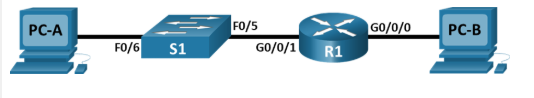
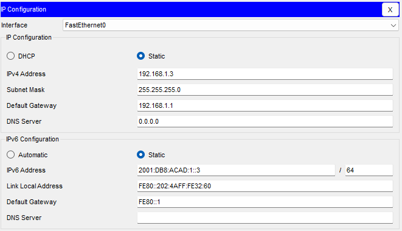
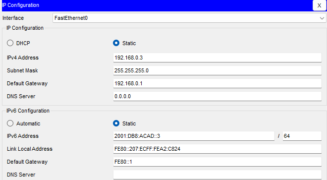
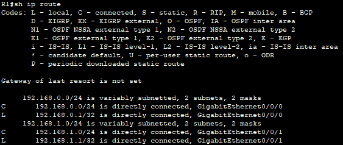
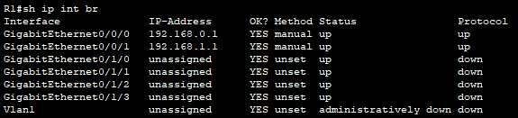
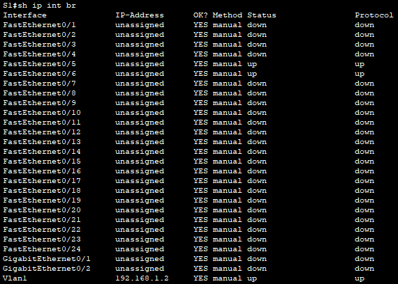
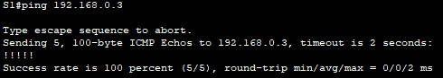

# Basic Router and Switch Network

## Overview

This lab demonstrates how to build a basic routed network using one router, one switch, and two PCs in Cisco Packet Tracer Physical Mode.

The network was configured with IPv4 and IPv6 addressing, basic device security, switch management access, and end-to-end connectivity verification.

## Objectives

* Build the physical topology using a router, switch, and two PCs
* Configure static IPv4 and IPv6 addressing
* Configure basic router security settings
* Configure switch management access through VLAN 1
* Verify end-to-end connectivity
* Display and interpret device information using IOS show commands

## Topology



## Addressing Table

| Device | Interface | IPv4 Address   | IPv6 Address                   | Default Gateway       |
| ------ | --------- | -------------- | ------------------------------ | --------------------- |
| R1     | G0/0/0    | 192.168.0.1/24 | 2001:db8:acad::1/64, fe80::1   | N/A                   |
| R1     | G0/0/1    | 192.168.1.1/24 | 2001:db8:acad:1::1/64, fe80::1 | N/A                   |
| S1     | VLAN 1    | 192.168.1.2/24 | N/A                            | 192.168.1.1           |
| PC-A   | NIC       | 192.168.1.3/24 | 2001:db8:acad:1::3/64          | 192.168.1.1 / fe80::1 |
| PC-B   | NIC       | 192.168.0.3/24 | 2001:db8:acad::3/64            | 192.168.0.1 / fe80::1 |

## Configuration Summary

### Router R1

The router was configured with:

* hostname `R1`
* encrypted privileged EXEC password
* console password
* VTY password
* password encryption
* MOTD banner
* IPv4 addressing on G0/0/0 and G0/0/1
* IPv6 global unicast and link-local addresses
* interface descriptions
* saved startup configuration

R1 connects two different networks:

| Interface | Connected To | Network        |
| --------- | ------------ | -------------- |
| G0/0/0    | PC-B         | 192.168.0.0/24 |
| G0/0/1    | S1           | 192.168.1.0/24 |

### Switch S1

The switch was configured with:

* hostname `S1`
* management IP address on VLAN 1
* default gateway pointing to R1
* saved startup configuration

S1 uses VLAN 1 for management access:

```text
S1 VLAN 1: 192.168.1.2/24
Default gateway: 192.168.1.1
```

### Host PC-A



### Host PC-B



## Verification

### Router Routing Table



The router learned two directly connected IPv4 networks:

```text
192.168.0.0/24 via GigabitEthernet0/0/0
192.168.1.0/24 via GigabitEthernet0/0/1
```

The `C` code in the routing table means directly connected network.

There are two directly connected routes:

* `192.168.0.0/24`
* `192.168.1.0/24`

### Router Interface Status

The command `show ip interface brief` confirmed that both main router interfaces were up:



The command `show ipv6 interface brief` confirmed that both router interfaces also had IPv6 addresses configured.

### Switch Interface Status



The switch management interface was active:

```text
Vlan1   192.168.1.2   up   up
```

The connected switch ports were:

```text
FastEthernet0/5   up   up
FastEthernet0/6   up   up
```

### Connectivity Test

End-to-end connectivity was verified using ping tests.



All ping packets were successful.

## Troubleshooting Notes

### Initial PC-A to PC-B ping failed

The initial ping from PC-A to PC-B failed because the router interfaces were not configured and activated yet. PC-A and PC-B are in different IPv4 networks, so traffic between them requires the router.

### Duplicate IP address issue

If R1 G0/0/1 were configured with `192.168.1.2`, it would conflict with the S1 VLAN 1 management address. This would create an IP address conflict and could break management connectivity and routing behavior in the 192.168.1.0/24 network.

## Lessons Learned

This lab helped reinforce the basic workflow for building and verifying a small routed network:

* A router is required for communication between different networks.
* Router interfaces must be configured and enabled with `no shutdown`.
* A Layer 2 switch needs a default gateway only for management traffic outside its local network.
* IPv6 routing must be enabled with `ipv6 unicast-routing`.
* `show` commands are essential for verifying interface status, routing, and connectivity.

## Files

| File | Description |
|---|---|
| [topology.png](./topology.png) | Final network topology |
| [basic-router-switch-network.pkt](./packet-tracer/basic-router-switch-network.pkt) | Completed Packet Tracer lab file |
| [R1-config.txt](./configs/R1-config.txt) | Final R1 configuration |
| [S1-config.txt](./configs/S1-config.txt) | Final S1 configuration |
| [screenshots/](./screenshots/) | Verification screenshots |
