# TCP and UDP Communications Analysis

## 📌Overview

This lab demonstrates how TCP and UDP traffic works in Cisco Packet Tracer Simulation Mode.

The goal of the lab was to observe and analyze how different application protocols use transport layer services. Several types of client traffic were generated and inspected through PDU details, including HTTP, FTP, DNS, SMTP, and POP3-related communication.

The lab helped demonstrate the difference between reliable TCP-based communication and faster connectionless UDP-based communication.

## 🎯Objectives

* Generate different types of network traffic in Simulation Mode
* Observe protocol multiplexing across the same network
* Analyze TCP communication and TCP flags
* Identify TCP source and destination ports
* Examine sequence and acknowledgment numbers
* Compare TCP and UDP behavior
* Identify application protocols by their port numbers
* Understand how email, DNS, HTTP, and FTP traffic use the transport layer

## Topology

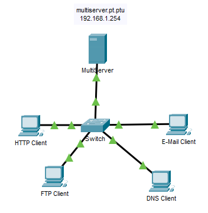

## 📋Addressing Table

The topology contains one MultiServer, one switch, and four client devices:

| Device        | Role                         | IP Address      |
| ------------- | ---------------------------- | --------------- |
| MultiServer   | HTTP, FTP, DNS, Email server | `192.168.1.254` |
| HTTP Client   | Web client                   | `192.168.1.1`   |
| FTP Client    | FTP client                   | `192.168.1.2`   |
| DNS Client    | DNS lookup client            | `192.168.1.3`   |
| E-Mail Client | Email client                 | `192.168.1.4`   |

## Traffic Generation Summary

The following traffic types were generated in Packet Tracer Simulation Mode:

| Client        | Application Traffic | Transport Protocol | Server Port |
| ------------- | ------------------- | ------------------ | ----------: |
| HTTP Client   | HTTP                | TCP                |          80 |
| FTP Client    | FTP                 | TCP                |          21 |
| DNS Client    | DNS                 | UDP                |          53 |
| E-Mail Client | SMTP                | TCP                |          25 |
| E-Mail Client | POP3                | TCP                |         110 |

## ⚙️Protocol Analysis Results

### HTTP over TCP

HTTP traffic uses TCP as its transport layer protocol.

Before the HTTP data is sent, TCP establishes a connection. This is why the HTTP PDU appears only after the TCP connection setup process.

Observed TCP details for the HTTP request:

| Field                 | Value      |
| --------------------- | ---------- |
| Source Port           | `1026`     |
| Destination Port      | `80`       |
| Sequence Number       | `1`        |
| Acknowledgment Number | `1`        |
| TCP Flags             | `PSH, ACK` |

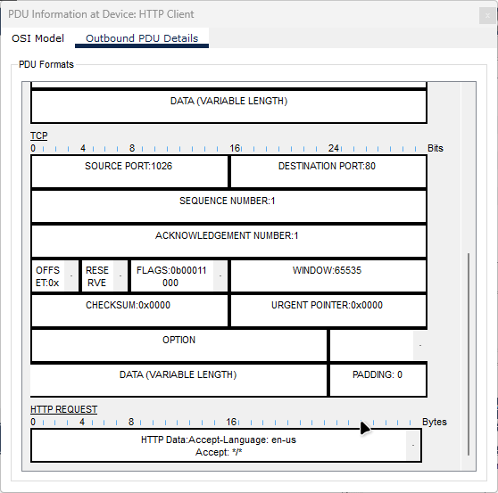

The `PSH, ACK` flags show that the TCP connection is already established and the segment is carrying application data.

### FTP over TCP

FTP also uses TCP because file transfer requires reliable delivery.

The FTP connection process shows the TCP three-way handshake:

| Step | Direction                 | TCP Flags  | Meaning                          |
| ---- | ------------------------- | ---------- | -------------------------------- |
| 1    | FTP Client to MultiServer | `SYN`      | Client requests a TCP connection |
| 2    | MultiServer to FTP Client | `SYN, ACK` | Server accepts and acknowledges  |
| 3    | FTP Client to MultiServer | `ACK`      | Client confirms the connection   |

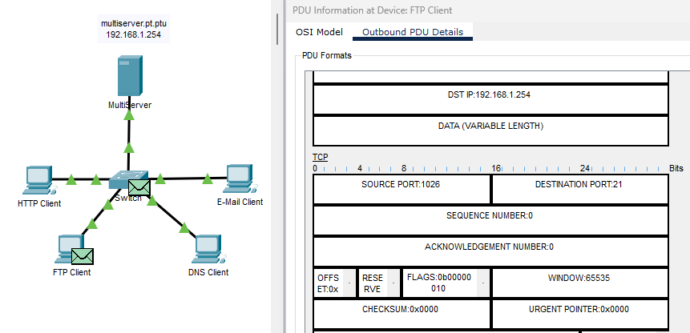
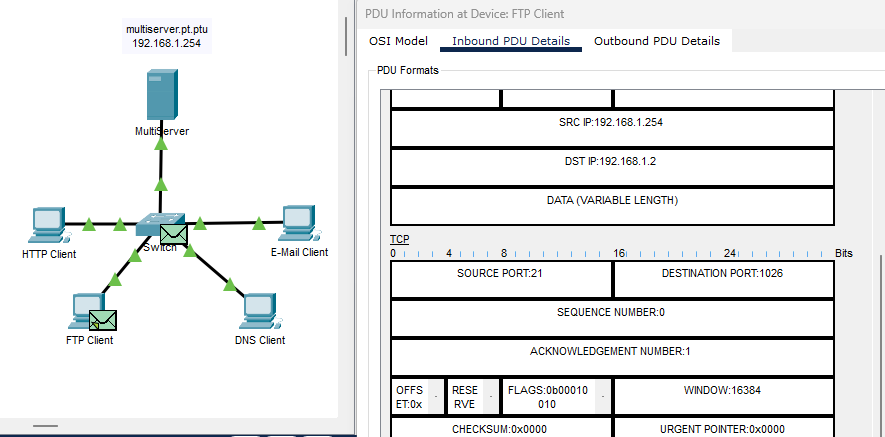
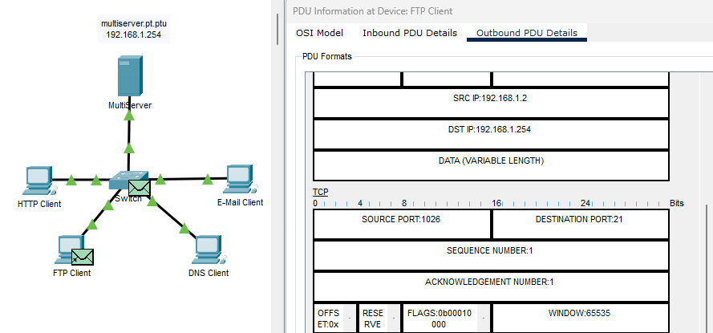

Observed FTP control connection:

| Field                   | Value  |
| ----------------------- | ------ |
| Client Source Port      | `1026` |
| Server Destination Port | `21`   |
| Server Port             | `21`   |
| Transport Protocol      | TCP    |

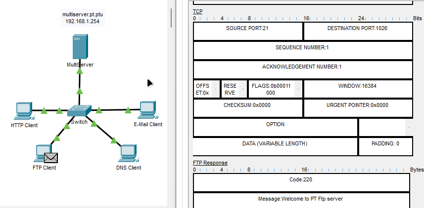

After the handshake, FTP application data is carried with `PSH, ACK`.

### DNS over UDP

DNS traffic uses UDP for standard name resolution queries.

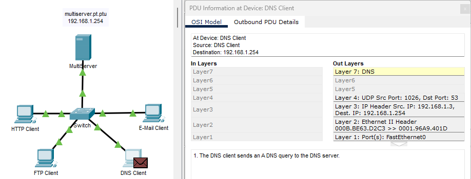

Observed DNS query:

| Field              | Value  |
| ------------------ | ------ |
| Source Port        | `1026` |
| Destination Port   | `53`   |
| Transport Protocol | UDP    |

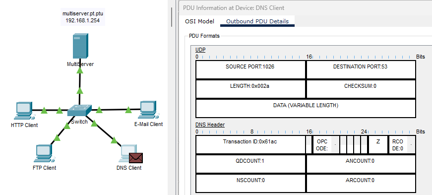

Observed DNS response:

| Field              | Value  |
| ------------------ | ------ |
| Source Port        | `53`   |
| Destination Port   | `1026` |
| Transport Protocol | UDP    |

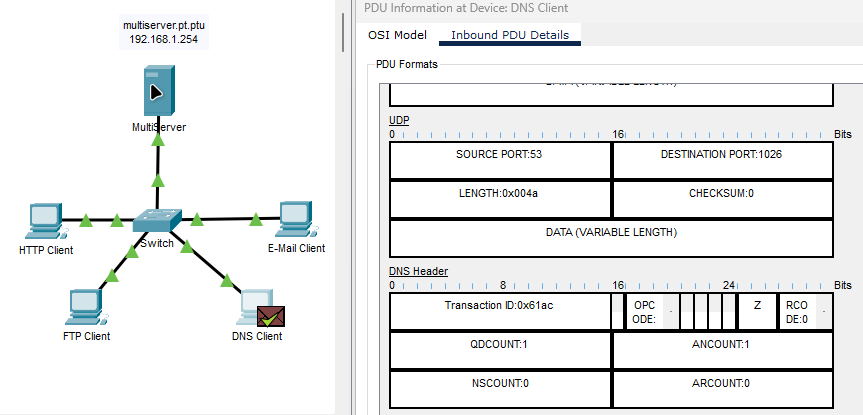

UDP does not use sequence numbers or acknowledgment numbers because it does not establish a reliable connection.

The DNS query resolved:

```text
multiserver.pt.ptu -> 192.168.1.254
```

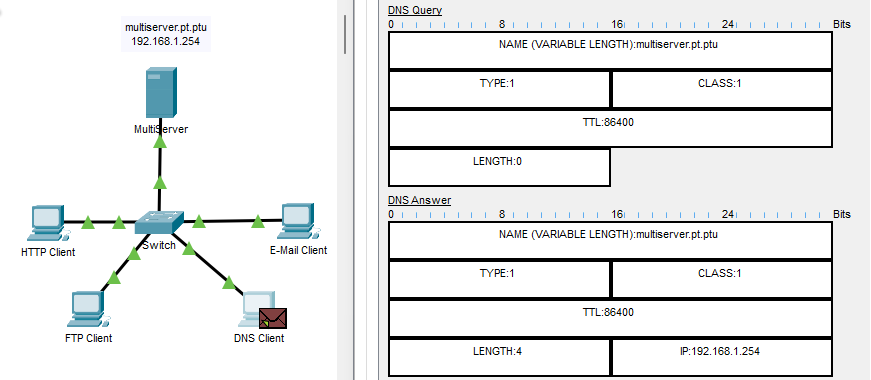

### Email over TCP

Email traffic uses TCP because email delivery requires reliable communication.

SMTP uses TCP port `25`.

Observed initial SMTP TCP connection:

| Field                 | Value  |
| --------------------- | ------ |
| Source Port           | `1026` |
| Destination Port      | `25`   |
| Sequence Number       | `0`    |
| Acknowledgment Number | `0`    |
| TCP Flags             | `SYN`  |

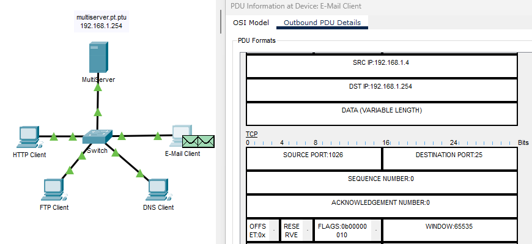

Observed server response:

| Field                 | Value      |
| --------------------- | ---------- |
| Source Port           | `25`       |
| Destination Port      | `1026`     |
| Sequence Number       | `0`        |
| Acknowledgment Number | `1`        |
| TCP Flags             | `SYN, ACK` |

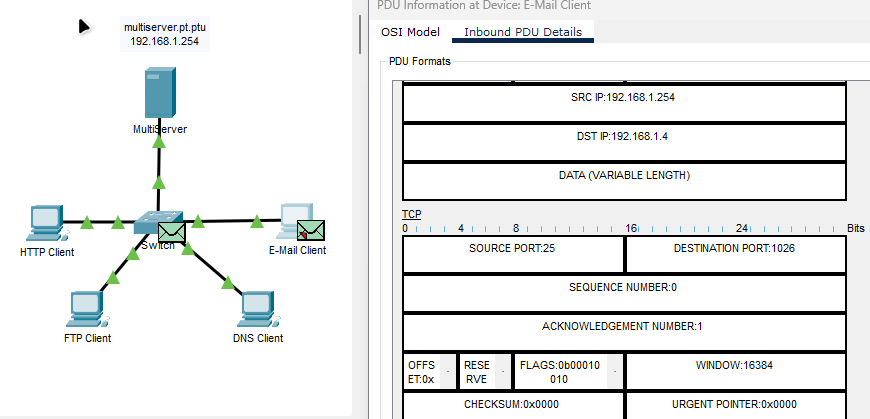

Observed SMTP application data segment:

| Field                 | Value      |
| --------------------- | ---------- |
| Source Port           | `1025`     |
| Destination Port      | `25`       |
| Sequence Number       | `1`        |
| Acknowledgment Number | `1`        |
| TCP Flags             | `PSH, ACK` |

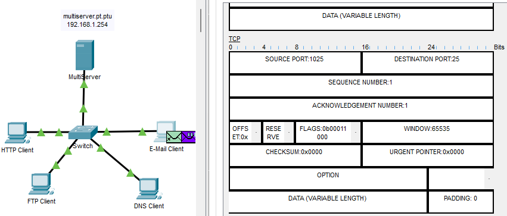

The source port can vary because it is dynamically selected by the client.

Email-related ports:

| Port | Protocol |
| ---: | -------- |
|   25 | SMTP     |
|  110 | POP3     |

## ✅Verification

The lab was verified by inspecting PDU details in Packet Tracer Simulation Mode.

Key verification points:

| Verification Item                                    | Result     |
| ---------------------------------------------------- | ---------- |
| HTTP traffic uses TCP                                | Confirmed  |
| FTP traffic uses TCP                                 | Confirmed  |
| DNS traffic uses UDP                                 | Confirmed  |
| Email traffic uses TCP                               | Confirmed  |
| TCP uses sequence and acknowledgment numbers         | Confirmed  |
| UDP does not use sequence and acknowledgment numbers | Confirmed  |
| TCP handshake uses SYN, SYN-ACK, ACK                 | Confirmed  |
| Application data uses PSH-ACK                        | Confirmed  |
| DNS uses port 53                                     | Confirmed  |
| HTTP uses port 80                                    | Confirmed  |
| FTP uses port 21                                     | Confirmed  |
| SMTP uses port 25                                    | Confirmed  |
| POP3 uses port 110                                   | Identified |

## 🧠Lessons Learned

* TCP and UDP both use port numbers to identify applications.
* TCP is connection-oriented and reliable.
* TCP uses sequence numbers, acknowledgment numbers, and flags.
* TCP establishes a connection before application data is sent.
* UDP is connectionless and does not use sequence or acknowledgment numbers.
* Common application protocols can be identified by their port numbers.
* TCP flags help identify connection setup, data transfer, and session termination.

## 📁Files

| File                                                                     | Description                 |
| ------------------------------------------------------------------------ | --------------------------- |
| [topology.png](./topology.png)                                           | Network topology            |
| [tcp-udp-communications.pka](./packet-tracer/tcp-udp-communications.pka) | Packet Tracer activity file |
| [screenshots/](./screenshots/)                                           | PDU analysis screenshots    |
