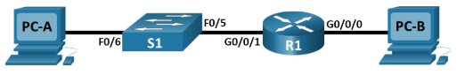
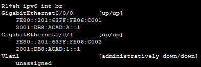
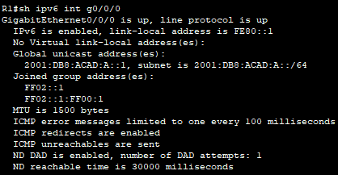

# IPv6 Addressing

## 📌Overview

This lab demonstrates manual IPv6 address configuration on Cisco network devices in Packet Tracer Physical Mode. The topology includes one router, one switch, and two end devices located in separate IPv6 networks.

The lab covers basic router and switch setup, manual IPv6 addressing, IPv6 link-local addressing, enabling IPv6 routing, and end-to-end connectivity verification using ping and tracert.

## 🎯Objectives

* Build and cable the network according to the topology.
* Configure basic settings on the router and switch.
* Manually assign IPv6 global unicast addresses.
* Configure IPv6 link-local addresses.
* Enable IPv6 unicast routing on the router.
* Configure IPv6 addressing on end devices.
* Verify end-to-end IPv6 connectivity.
* Use show commands to verify interface and IPv6 configuration.

## Topology



## 📋Addressing Table

| Device | Interface |         IPv6 Address | Prefix Length | Default Gateway |
| ------ | --------- | -------------------: | ------------: | --------------- |
| R1     | G0/0/0    | `2001:db8:acad:a::1` |            64 | N/A             |
| R1     | G0/0/1    | `2001:db8:acad:1::1` |            64 | N/A             |
| S1     | VLAN 1    | `2001:db8:acad:1::b` |            64 | `fe80::1`       |
| PC-A   | NIC       | `2001:db8:acad:1::3` |            64 | `fe80::1`       |
| PC-B   | NIC       | `2001:db8:acad:a::3` |            64 | `fe80::1`       |

## ⚙️Configuration Summary

### Router R1

The router was configured with:

* hostname `R1`
* IPv6 global unicast address on `G0/0/0`
* IPv6 global unicast address on `G0/0/1`
* manually configured IPv6 link-local address `fe80::1` on both router interfaces
* IPv6 unicast routing enabled
* active router interfaces with `no shutdown`
* IPv6 connectivity between two different networks

R1 connects two IPv6 networks:

| Interface | Connected To | IPv6 Network           |
| --------- | ------------ | ---------------------- |
| G0/0/0    | PC-B         | `2001:db8:acad:a::/64` |
| G0/0/1    | S1 / PC-A    | `2001:db8:acad:1::/64` |

The same link-local address `fe80::1` was used on both R1 interfaces because each router interface belongs to a different local network segment.

### Switch S1

The switch was configured with:

* hostname `S1`
* IPv6 management address on VLAN 1
* manually configured link-local address on VLAN 1
* active SVI interface with `no shutdown`
* management access through VLAN 1

S1 uses VLAN 1 for management access:

```text
S1 VLAN 1: 2001:db8:acad:1::b/64
S1 VLAN 1 link-local: fe80::b
Default gateway: fe80::1
```

The link-local address on S1 was corrected from `fe80::1` to `fe80::b` to avoid using the same link-local address as R1 in the same local segment.

### Host PC-A


### Host PC-B


## ✅Verification

### Router IPv6 Interface Status

The command `show ipv6 interface brief` confirmed that both router interfaces were up and had IPv6 addresses configured.



### Router IPv6 Interface Details

The command `show ipv6 interface g0/0/0` confirmed that the manually configured link-local address was applied.



### Switch VLAN 1 IPv6 Status

The command `show ipv6 interface vlan1` confirmed that the S1 management interface was active.


### PC-B SLAAC Verification

Before IPv6 routing was enabled on R1, PC-B had only a link-local IPv6 address.

After enabling IPv6 unicast routing on R1, PC-B received:


This happened because R1 started sending IPv6 Router Advertisement messages, allowing PC-B to automatically generate an IPv6 address using SLAAC.

### Connectivity Test from PC-A

PC-A successfully pinged the R1 link-local address and also successfully traced the route to PC-B:


This confirms that traffic from PC-A to PC-B is routed through R1.

### Connectivity Test from PC-B

PC-B successfully pinged PC-A and also successfully pinged the R1 link-local address:


## 🛠️Troubleshooting Notes

### Incorrect S1 link-local address

Initially, S1 VLAN 1 was configured with:

```text
ipv6 address fe80::1 link-local
```

This was incorrect because `fe80::1` was already used by R1 in the same local network segment.

The correct S1 VLAN 1 link-local address is:

```text
ipv6 address fe80::b link-local
```

This keeps link-local addressing unique inside the local segment and matches the addressing table.

## 🧠Lessons Learned

This lab helped reinforce the basic IPv6 configuration workflow on Cisco devices:

* IPv6 global unicast addresses identify devices inside IPv6 networks.
* IPv6 link-local addresses are used for local-link communication.
* The same link-local address can be reused on different router interfaces if those interfaces are in different local networks.
* Link-local addresses must be unique within the same local segment.
* IPv6 routing must be enabled with `ipv6 unicast-routing`.
* Router Advertisement messages allow hosts to receive IPv6 addressing information through SLAAC.
* `ping`, `tracert`, `show ipv6 interface brief`, and `show ipv6 interface` are useful commands for verification and troubleshooting.

## 📁Files

| File | Description |
|---|---|
| [topology.png](./topology.png) | Final network topology |
| [ipv6-router-switch-connectivity.pka](./packet-tracer/ipv6-router-and-switch-connectivity.pka) | Completed Packet Tracer lab file |
| [R1-config.txt](./configs/r1-config.txt) | Final R1 configuration |
| [S1-config.txt](./configs/s1-config.txt) | Final S1 configuration |
| [screenshots/](./screenshots/) | Verification screenshots |