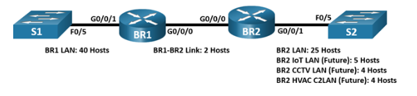
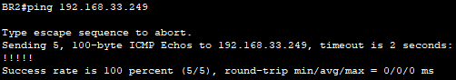
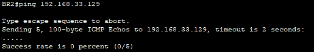

# VLSM Design and Implementation

## 📌Overview

This lab demonstrates how to design and implement an IPv4 addressing scheme using Variable Length Subnet Masking, VLSM, in Cisco Packet Tracer Physical Mode.

The starting network was 192.168.33.128/25. The network was divided into multiple subnets of different sizes based on the number of required hosts. After the VLSM plan was completed, the router interfaces were configured with the calculated IPv4 addresses and connectivity was verified across the point-to-point router link.

## 🎯Objectives

* Examine the network requirements
* Design a VLSM addressing scheme
* Allocate subnets based on host requirements
* Document the final addressing plan and device configurations
* Configure basic router security settings
* Configure IPv4 addresses on router interfaces
* Save the running configuration
* Verify connectivity between BR1 and BR2

## Topology



## 📋VLSM Addressing Plan

Starting network:

```text
192.168.33.128/25
```

Available usable host addresses in `/25`:

```text
126 hosts
```

Host requirements:

| Subnet         | Hosts Needed |
| -------------- | -----------: |
| BR1 LAN        |           40 |
| BR2 LAN        |           25 |
| BR2 IoT LAN    |            5 |
| BR2 CCTV LAN   |            4 |
| BR2 HVAC C2LAN |            4 |
| BR1-BR2 Link   |            2 |

The subnets were allocated from largest to smallest to avoid wasting IPv4 addresses.

| Subnet Description | Hosts Needed | Network Address / CIDR | First Usable Host | Broadcast Address |
| ------------------ | -----------: | ---------------------- | ----------------- | ----------------- |
| BR1 LAN            |           40 | `192.168.33.128/26`    | `192.168.33.129`  | `192.168.33.191`  |
| BR2 LAN            |           25 | `192.168.33.192/27`    | `192.168.33.193`  | `192.168.33.223`  |
| BR2 IoT LAN        |            5 | `192.168.33.224/29`    | `192.168.33.225`  | `192.168.33.231`  |
| BR2 CCTV LAN       |            4 | `192.168.33.232/29`    | `192.168.33.233`  | `192.168.33.239`  |
| BR2 HVAC C2LAN     |            4 | `192.168.33.240/29`    | `192.168.33.241`  | `192.168.33.247`  |
| BR1-BR2 Link       |            2 | `192.168.33.248/30`    | `192.168.33.249`  | `192.168.33.251`  |

## 📋Device Addressing Table

| Device | Interface | IP Address       | Subnet Mask       | Network / Purpose |
| ------ | --------- | ---------------- | ----------------- | ----------------- |
| BR1    | G0/0/0    | `192.168.33.249` | `255.255.255.252` | BR1-BR2 Link      |
| BR1    | G0/0/1    | `192.168.33.129` | `255.255.255.192` | BR1 LAN           |
| BR2    | G0/0/0    | `192.168.33.250` | `255.255.255.252` | BR1-BR2 Link      |
| BR2    | G0/0/1    | `192.168.33.193` | `255.255.255.224` | BR2 LAN           |

## ⚙️Configuration Summary

### Router BR1

The router was configured with:

* hostname `BR1`
* encrypted privileged EXEC password
* console password
* VTY password
* password encryption
* MOTD banner
* IPv4 addressing on `G0/0/0` and `G0/0/1`
* interface descriptions
* active interfaces using `no shutdown`
* saved startup configuration

BR1 connects the BR1 LAN and the point-to-point link to BR2:

| Interface | Connected To | Network             |
| --------- | ------------ | ------------------- |
| G0/0/0    | BR2          | `192.168.33.248/30` |
| G0/0/1    | S1 / BR1 LAN | `192.168.33.128/26` |

### Router BR2

The router was configured with:

* hostname `BR2`
* encrypted privileged EXEC password
* console password
* VTY password
* password encryption
* MOTD banner
* IPv4 addressing on `G0/0/0` and `G0/0/1`
* interface descriptions
* active interfaces using `no shutdown`
* saved startup configuration

BR2 connects the point-to-point link to BR1 and the BR2 LAN:

| Interface | Connected To | Network             |
| --------- | ------------ | ------------------- |
| G0/0/0    | BR1          | `192.168.33.248/30` |
| G0/0/1    | S2 / BR2 LAN | `192.168.33.192/27` |

### Future BR2 LANs

The following subnets were planned and reserved, but no router interfaces were configured for them in this lab:

| Future LAN     | Network             | Usable Range                      |
| -------------- | ------------------- | --------------------------------- |
| BR2 IoT LAN    | `192.168.33.224/29` | `192.168.33.225 - 192.168.33.230` |
| BR2 CCTV LAN   | `192.168.33.232/29` | `192.168.33.233 - 192.168.33.238` |
| BR2 HVAC C2LAN | `192.168.33.240/29` | `192.168.33.241 - 192.168.33.246` |

## ✅Verification

### BR1 to BR2 Link Test

BR1 successfully pinged the BR2 G0/0/0 interface:


The first packet was lost because ARP resolution had to occur before successful ICMP replies were received.

### BR2 to BR1 Link Test

BR2 successfully pinged the BR1 G0/0/0 interface:



### Expected Failed Ping to Remote LAN Interface

BR2 attempted to ping the BR1 LAN interface:



This was expected in this lab because no static routes or dynamic routing protocol were configured. BR2 only knew about its directly connected networks.

## 🛠️Troubleshooting Notes

### VTY line range correction

Initially only one VTY line was configured.

The configuration was later corrected to include all available VTY lines:

```text
line vty 0 15
 password cisco
 login
```


## 🧠Lessons Learned

This lab helped reinforce the practical process of VLSM design and implementation:

* VLSM allows subnets of different sizes to be created from one larger network.
* Subnets should be allocated from largest to smallest to reduce address waste.
* The original `/25` network provided enough address space for all required subnets.
* `/26` was used for the 40-host LAN.
* `/27` was used for the 25-host LAN.
* `/29` was used for small future LANs.
* `/30` was used for the point-to-point router link.
* Directly connected router interfaces can communicate without static or dynamic routing.
* Communication to remote LAN interfaces requires routing information.

## 📁Files

| File | Description |
|---|---|
| [topology.png](./topology.png) | Network topology |
| [vlsm-design-and-implementation.pkt](./packet-tracer/vlsm-design-and-implementation.pka) | Completed Packet Tracer lab file |
| [BR1-config.txt](./configs/br1-config.txt) | Final BR1 configuration |
| [BR2-config.txt](./configs/br2-config.txt) | Final BR2 configuration |
| [screenshots/](./screenshots/) | Verification screenshots |