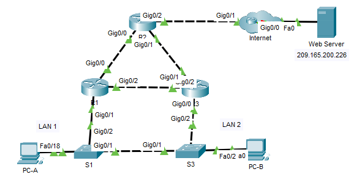
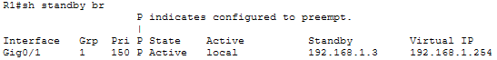
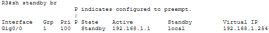
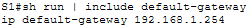
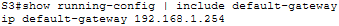
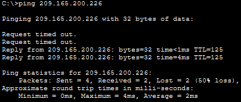
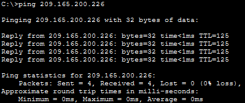
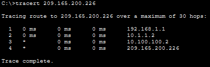
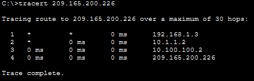
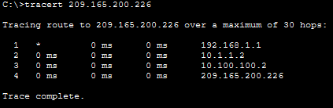

# HSRP Configuration

## 📌 Overview

This lab demonstrates how Hot Standby Router Protocol (HSRP) provides a redundant default gateway for end devices. R1 and R3 share the virtual gateway address `192.168.1.254`. R1 is configured as the preferred active router, while R3 operates as the standby router and takes over when the active path becomes unavailable.

The HSRP roles, end-to-end connectivity, failover, and recovery behavior are verified with show commands, ping, and traceroute.

## 🎯 Objectives

- Configure HSRP on R1 and R3.
- Configure HSRP group 1 with virtual gateway `192.168.1.254`.
- Make R1 the preferred active router by using priority and preemption.
- Configure R3 as the standby router.
- Update the switches and hosts to use the HSRP virtual gateway.
- Verify HSRP active and standby roles.
- Test connectivity to the Web Server.
- Verify gateway failover and recovery.

## Topology



## 📋 Addressing Table

| Device | Interface | IP Address | Initial Default Gateway | Final Default Gateway |
|---|---|---:|---:|---:|
| R1 | G0/0 | `10.1.1.1/30` | N/A | N/A |
| R1 | G0/1 | `192.168.1.1/24` | N/A | N/A |
| R1 | G0/2 | `10.1.1.9/30` | N/A | N/A |
| R2 | G0/0 | `10.1.1.2/30` | N/A | N/A |
| R2 | G0/1 | `10.1.1.5/30` | N/A | N/A |
| R2 | G0/2 | `10.100.100.1/30` | N/A | N/A |
| R3 | G0/0 | `192.168.1.3/24` | N/A | N/A |
| R3 | G0/1 | `10.1.1.6/30` | N/A | N/A |
| R3 | G0/2 | `10.1.1.10/30` | N/A | N/A |
| I-Net | G0/1 | `10.100.100.2/30` | N/A | N/A |
| HSRP Virtual Gateway | Virtual | `192.168.1.254/24` | N/A | N/A |
| S1 | VLAN 1 | `192.168.1.11/24` | `192.168.1.1` | `192.168.1.254` |
| S3 | VLAN 1 | `192.168.1.13/24` | `192.168.1.3` | `192.168.1.254` |
| PC-A | NIC | `192.168.1.101/24` | `192.168.1.1` | `192.168.1.254` |
| PC-B | NIC | `192.168.1.103/24` | `192.168.1.3` | `192.168.1.254` |
| Web Server | NIC | `209.165.200.226/27` | `209.165.100.225` | `209.165.100.225` |

## ⚙️ Configuration Summary

### R1 — Preferred Active Router

HSRP version 2 was enabled on the LAN-facing interface. R1 was assigned priority 150 and configured with preemption, so it becomes active when available.

```cisco
interface GigabitEthernet0/1
 standby version 2
 standby 1 ip 192.168.1.254
 standby 1 priority 150
 standby 1 preempt
```

### R3 — Standby Router

R3 joined the same HSRP group and uses the default HSRP priority of 100. Because its priority is lower than R1's, it normally remains in the standby state.

```cisco
interface GigabitEthernet0/0
 standby version 2
 standby 1 ip 192.168.1.254
```

### S1 and S3

The management default gateway on both switches was changed from the physical router address to the HSRP virtual address.

```cisco
ip default-gateway 192.168.1.254
```

### PC-A and PC-B

The default gateway on both hosts was changed to `192.168.1.254`.

## ✅ Verification

### HSRP Roles

The `show standby brief` output confirms that R1 is active with priority 150 and preemption, while R3 is standby with the default priority of 100.





### Switch Default Gateways

The running configuration on both switches reference the virtual gateway rather than a physical router address.





### End-to-End Connectivity

PC-A and PC-B successfully reach the Web Server at `209.165.200.226` while using the virtual gateway.





### Normal Path Before Failover

With R1 active, traffic from PC-B should use R1 as the first-hop gateway and then continue through R2 and I-Net toward the Web Server.



Path: `PC-B → R1 → R2 → I-Net → Web Server`

### Failover to R3

After the link between R1 and S1 is disconnected, HSRP should promote R3 to the active state. The first traceroute attempt may contain timeouts while HSRP converges. A repeated trace should use R3 as the first hop.



Path after convergence: `PC-B → R3 → R2 → I-Net → Web Server`

### Recovery and Preemption

After the R1–S1 link is restored, R1 should regain the active role because it has the higher priority and preemption enabled.



Path after reconvergence: `PC-B → R1 → R2 → I-Net → Web Server`

## 🛠️Troubleshooting Notes

### Temporary timeouts during HSRP failover

Immediately after the link between R1 and S1 was disconnected, the first traceroute attempts showed timeouts. This occurred because HSRP required time to detect that the active router was unavailable and transition R3 from the Standby state to the Active state.

After HSRP convergence was completed, connectivity to the Web Server was restored through R3 without changing the default gateway configuration on the hosts.

### R1 does not immediately return to the Active state

After the link between R1 and S1 was restored, HSRP required time to reconverge. Because R1 was configured with a priority of `150` and the `standby 1 preempt` command, it eventually resumed the Active role.

## 🧠 Lessons Learned

- A single physical default gateway creates a first-hop single point of failure.
- HSRP presents multiple routers to hosts as one virtual router with a shared virtual IP and MAC address.
- HSRP priority determines the preferred active router;
- Preemption allows a higher-priority router to regain the active role after recovery.
- End devices continue using the same virtual gateway during failover, so no client reconfiguration is required.
- `show standby brief` is the fastest command for checking HSRP roles, priorities, peer addresses, and the virtual IP.

## 📁Files

| File | Description |
| ---- | ----------- |
| [topology.png](./topology.png) | Completed Packet Tracer topology |
| [hsrp-configuration.pka](./packet-tracer/hsrp-configuration.pka) | Completed Packet Tracer lab file |
| [r1-config.txt](./configs/r1-config.txt) | Final R1 configuration |
| [r3-config.txt](./configs/r3-config.txt) | Final R3 configuration |
| [s1-config.txt](./configs/s1-config.txt) | Final S1 configuration |
| [s3-config.txt](./configs/s3-config.txt) | Final S3 configuration |
| [screenshots/](./screenshots/) | Verification screenshots |
