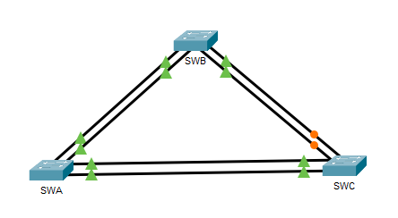
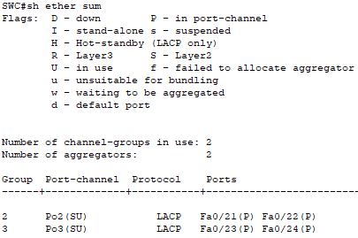
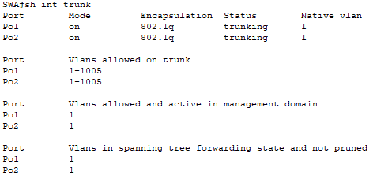
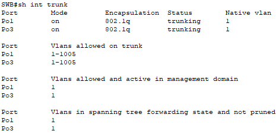
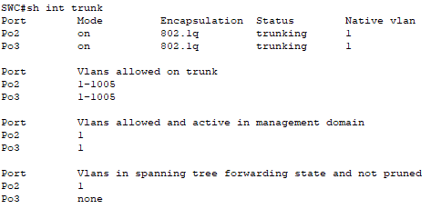
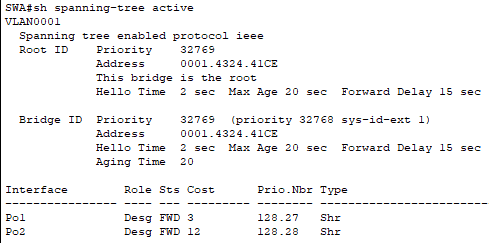
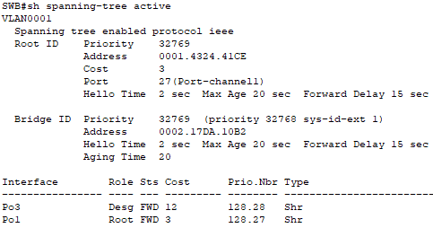
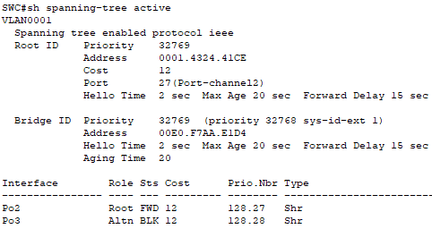

# Implement EtherChannel

## 📌Overview

This lab demonstrates how to implement EtherChannel between three switches.

The topology uses three logical Port-channel links:

* Port-channel 1 between SWA and SWB using PAgP
* Port-channel 2 between SWA and SWC using LACP
* Port-channel 3 between SWB and SWC using LACP as a backup EtherChannel path

All EtherChannel member ports were configured as trunk ports.

## 🎯Objectives

* Build a three-switch topology.
* Configure trunk ports for EtherChannel links.
* Configure a PAgP EtherChannel between SWA and SWB.
* Configure an LACP EtherChannel between SWA and SWC.
* Configure a backup LACP EtherChannel between SWB and SWC.
* Verify EtherChannel status.
* Verify trunk status.
* Observe STP behavior in a redundant Layer 2 topology.

## Topology

## 📋Port Channel Table

| Port Channel | Devices | Physical Links | Protocol | Negotiation Mode |
| ------------ | ------- | -------------- | -------- | ---------------- |
| 1 | SWA to SWB | G0/1 to G0/1, G0/2 to G0/2 | PAgP | desirable / desirable |
| 2 | SWA to SWC | F0/21 to F0/21, F0/22 to F0/22 | LACP | active / active |
| 3 | SWB to SWC | F0/23 to F0/23, F0/24 to F0/24 | LACP | SWB passive, SWC active |

## ⚙️Configuration Summary

### SWA

SWA was configured with:

* G0/1 and G0/2 as trunk ports.
* G0/1 and G0/2 assigned to Port-channel 1 using PAgP desirable mode.
* F0/21 and F0/22 as trunk ports.
* F0/21 and F0/22 assigned to Port-channel 2 using LACP active mode.
* Port-channel 1 configured as a trunk.
* Port-channel 2 configured as a trunk.

### SWB

SWB was configured with:

* G0/1 and G0/2 as trunk ports.
* G0/1 and G0/2 assigned to Port-channel 1 using PAgP desirable mode.
* F0/23 and F0/24 as trunk ports.
* F0/23 and F0/24 assigned to Port-channel 3 using LACP passive mode.
* Port-channel 1 configured as a trunk.
* Port-channel 3 configured as a trunk.

### SWC

SWC was configured with:

* F0/21 and F0/22 as trunk ports.
* F0/21 and F0/22 assigned to Port-channel 2 using LACP active mode.
* F0/23 and F0/24 as trunk ports.
* F0/23 and F0/24 assigned to Port-channel 3 using LACP active mode.
* Port-channel 2 configured as a trunk.
* Port-channel 3 configured as a trunk.

## ✅Verification

### EtherChannel Summary

The `show etherchannel summary` command confirms the Port-channel number, protocol, status, and bundled physical interfaces.

Expected successful output indicators:

* `SU` - Layer 2 EtherChannel is in use.
* `P` - physical port is bundled in the Port-channel.
* `LACP` - LACP is used for Port-channel 2 and Port-channel 3.
* `PAgP` - PAgP is used for Port-channel 1.

This confirms that the EtherChannel configuration is working correctly.

### Trunk Verification

The `show interfaces trunk` command confirms that the logical Port-channel interfaces are operating as trunks.

### STP Verification

The `show spanning-tree active` command shows which logical links are forwarding and which redundant link is blocked by STP.

In this topology, Port-channel 3 may appear as a backup path because the network has redundant Layer 2 links.

## 🛠️Troubleshooting Notes

### Orange links on the topology

If the SWC F0/23-F0/24 links appear orange in Packet Tracer, it does not necessarily mean that EtherChannel is misconfigured.

Because the topology has redundant Layer 2 paths, STP can block one logical path to prevent a switching loop. If `show etherchannel summary` shows `Po3(SU)` and `Fa0/23(P) Fa0/24(P)`, the EtherChannel is formed correctly, and the orange indication is likely caused by STP blocking the backup path.

## 🧠Lessons Learned

This lab helped reinforce the practical process of configuring EtherChannel:

* EtherChannel combines multiple physical links into one logical Port-channel.
* PAgP is a Cisco proprietary EtherChannel negotiation protocol.
* LACP is an open standard EtherChannel negotiation protocol.
* Member ports must have consistent trunk settings.
* PAgP desirable mode actively negotiates an EtherChannel.
* LACP active mode actively negotiates an EtherChannel.
* LACP passive mode waits for the other side to initiate negotiation.
* STP treats an EtherChannel bundle as one logical link.
* A redundant EtherChannel can be blocked by STP to prevent Layer 2 loops.

## 📁Files

| File | Description |
| ---- | ----------- |
| [topology.png](./topology.png) | Completed Packet Tracer topology |
| [port-channel-table.png](./port-channel-table.png) | Port-channel connection table |
| [implement-etherchannel.pka](./packet-tracer/implement-etherchannel.pka) | Completed Packet Tracer lab file |
| [swa-config.txt](./configs/swa-config.txt) | Final SWA configuration |
| [swb-config.txt](./configs/swb-config.txt) | Final SWB configuration |
| [swc-config.txt](./configs/swc-config.txt) | Final SWC configuration |
| [screenshots/](./screenshots/) | Verification screenshots |
