# Implement VLANs and Trunking

## 📌Overview

This lab demonstrates VLAN creation, access port assignment, voice VLAN configuration, management SVI configuration, and trunking between switches.

VLANs are configured for Admin, Accounts, HR, Voice, Management, and Native traffic. The SWA-SWB link is configured as a static trunk with DTP disabled, while the SWA-SWC link demonstrates dynamic trunk negotiation using DTP.

## 🎯Objectives

* Configure VLANs on multiple switches.
* Assign access ports to the correct VLANs.
* Configure a voice VLAN for an IP phone.
* Configure management SVIs on all switches.
* Configure a static trunk between SWA and SWB.
* Disable DTP on the static trunk.
* Configure dynamic trunking between SWA and SWC.
* Change the native VLAN.
* Verify VLANs, trunks, and end-to-end connectivity.

## Topology

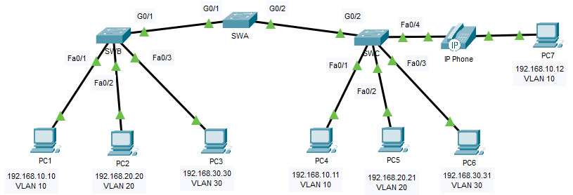

## 📋Addressing Table

| Device | Interface | IP Address | Subnet Mask | Switchport | VLAN |
|---|---|---:|---:|---|---|
| PC1 | NIC | 192.168.10.10 | 255.255.255.0 | SWB F0/1 | VLAN 10 |
| PC2 | NIC | 192.168.20.20 | 255.255.255.0 | SWB F0/2 | VLAN 20 |
| PC3 | NIC | 192.168.30.30 | 255.255.255.0 | SWB F0/3 | VLAN 30 |
| PC4 | NIC | 192.168.10.11 | 255.255.255.0 | SWC F0/1 | VLAN 10 |
| PC5 | NIC | 192.168.20.21 | 255.255.255.0 | SWC F0/2 | VLAN 20 |
| PC6 | NIC | 192.168.30.31 | 255.255.255.0 | SWC F0/3 | VLAN 30 |
| PC7 | NIC | 192.168.10.12 | 255.255.255.0 | SWC F0/4 | VLAN 10 / VLAN 40 Voice |
| SWA | SVI | 192.168.99.252 | 255.255.255.0 | N/A | VLAN 99 |
| SWB | SVI | 192.168.99.253 | 255.255.255.0 | N/A | VLAN 99 |
| SWC | SVI | 192.168.99.254 | 255.255.255.0 | N/A | VLAN 99 |

## ⚙️Configuration Summary

### VLANs

The following VLANs were created on all three switches:

| VLAN | Name | Purpose |
|---:|---|---|
| 10 | Admin | Admin user traffic |
| 20 | Accounts | Accounts user traffic |
| 30 | HR | HR user traffic |
| 40 | Voice | IP phone voice traffic |
| 99 | Management | Switch management SVI |
| 100 | Native | Native VLAN for trunk links |

### SWA

The SWA switch was configured with:

- Created VLANs 10, 20, 30, 40, 99, and 100.
- Configured VLAN 99 SVI with IP address `192.168.99.252/24`.
- Configured G0/1 as a static trunk to SWB.
- Disabled DTP on G0/1 using `switchport nonegotiate`.
- Configured VLAN 100 as the native VLAN on G0/1.
- Configured G0/2 as `dynamic desirable` to negotiate trunking with SWC.
- Configured VLAN 100 as the native VLAN on G0/2.

### SWB

The SWB switch was configured with:

- Created VLANs 10, 20, 30, 40, 99, and 100.
- Assigned F0/1 to VLAN 10.
- Assigned F0/2 to VLAN 20.
- Assigned F0/3 to VLAN 30.
- Configured VLAN 99 SVI with IP address `192.168.99.253/24`.
- Configured G0/1 as a static trunk to SWA.
- Disabled DTP on G0/1.
- Configured VLAN 100 as the native VLAN on G0/1.

### SWC

The SWC switch was configured with:

- Created VLANs 10, 20, 30, 40, 99, and 100.
- Assigned F0/1 to VLAN 10.
- Assigned F0/2 to VLAN 20.
- Assigned F0/3 to VLAN 30.
- Assigned F0/4 to VLAN 10 for data traffic.
- Configured VLAN 40 as the voice VLAN on F0/4.
- Enabled CoS trust on F0/4 for voice traffic.
- Configured VLAN 99 SVI with IP address `192.168.99.254/24`.
- Used G0/2 as the trunk link to SWA.
- Configured VLAN 100 as the native VLAN on G0/2.

## ✅Verification

### VLAN Verification

The `show vlan brief` command confirms that VLANs were created and access ports were assigned correctly.

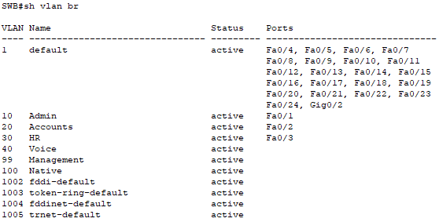

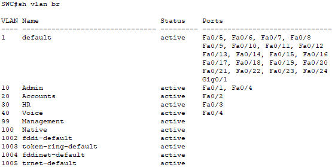

### Trunk Verification

The `show interfaces trunk` command confirms trunk status, trunk mode, native VLAN, and allowed VLANs.

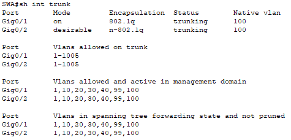

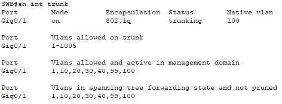

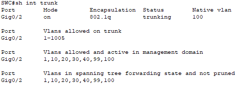

### Voice VLAN Verification

The `show interfaces fa0/4 switchport` command confirms that SWC F0/4 uses VLAN 10 as the data VLAN and VLAN 40 as the voice VLAN.

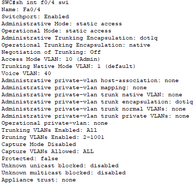

### Connectivity Tests

Devices in the same VLAN can communicate across the trunk links.

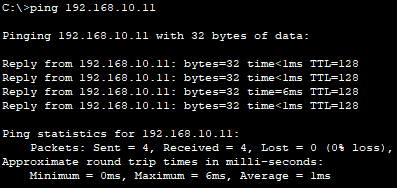

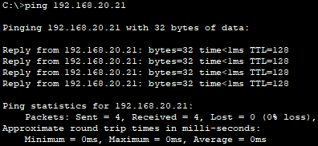

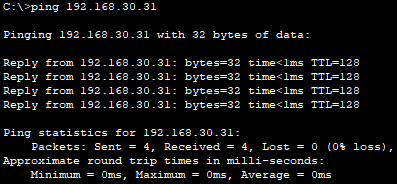

Devices in different VLANs cannot communicate without inter-VLAN routing.

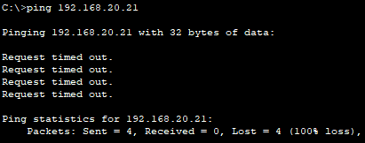

## 🛠️Troubleshooting Notes

### Management VLAN connectivity before trunking

After the VLAN 99 SVIs were configured, the switches were not expected to ping each other yet.

This was normal because the management VLAN needed to be carried across trunk links before the switches could communicate through VLAN 99.

### Native VLAN consistency

The native VLAN was changed from VLAN 1 to VLAN 100.

The same native VLAN must be configured on both ends of each trunk. If the native VLAN does not match, untagged traffic can be placed into the wrong VLAN and the switch may report a native VLAN mismatch.

## 🧠Lessons Learned

This lab helped reinforce the practical process of VLAN and trunk configuration:

* VLANs logically separate a switched network into different broadcast domains.
* Access ports must also be assigned to the correct VLANs.
* Trunk ports carry traffic for multiple VLANs between switches.
* A voice VLAN allows an IP phone and a PC to share one physical switch port while keeping voice and data traffic separate.
* Management SVIs allow switches to be managed through an IP address, but they do not provide routing between VLANs.
* Static trunking is more predictable than dynamic trunk negotiation.
* DTP can dynamically negotiate trunking, but it should be controlled carefully.
* The native VLAN should be changed from VLAN 1 and must match on both sides of a trunk.

## 📁Files

| File | Description |
|---|---|
| [topology.png](./topology.png) | Lab topology |
| [implement-vlans-and-trunking.pka](./packet-tracer/implement-vlans-and-trunking.pka) | Cisco Packet Tracer lab file |
| [SWA-config.txt](./configs/SWA-config.txt) | Final SWA configuration |
| [SWB-config.txt](./configs/SWB-config.txt) | Final SWB configuration |
| [SWC-config.txt](./configs/SWC-config.txt) | Final SWC configuration |
| [screenshots](./screenshots/) | Verification screenshots |