# Inter-VLAN Routing Challenge

## 📌Overview

This lab demonstrates how to implement inter-VLAN routing using the router-on-a-stick method.

The network uses one router, one switch, three VLANs for user devices, one native VLAN, and one management VLAN. The switch access ports were assigned to the correct VLANs, unused switch ports were disabled, and the link between S1 and R1 was configured as a static 802.1Q trunk.

Router R1 was configured with subinterfaces for VLAN 10, VLAN 20, VLAN 30, VLAN 88, and VLAN 99. Each router subinterface acts as the default gateway for its VLAN.

## 🎯Objectives

* Configure VLANs on S1
* Assign switch ports to the correct VLANs
* Configure access ports on S1
* Configure the management SVI on S1
* Configure the default gateway on S1
* Configure G0/1 on S1 as a static trunk
* Configure VLAN 88 as the native VLAN
* Disable unused switch ports
* Configure router-on-a-stick inter-VLAN routing on R1
* Verify connectivity between VLANs
* Verify connectivity from the PCs to the server

## Topology

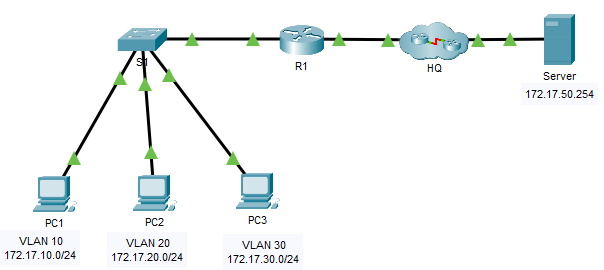

## 📋Addressing Table

| Device | Interface | IP Address | Subnet Mask | Default Gateway |
| ------ | --------- | ---------- | ----------- | --------------- |
| R1 | G0/0 | `172.17.25.2` | `255.255.255.252` | N/A |
| R1 | G0/1.10 | `172.17.10.1` | `255.255.255.0` | N/A |
| R1 | G0/1.20 | `172.17.20.1` | `255.255.255.0` | N/A |
| R1 | G0/1.30 | `172.17.30.1` | `255.255.255.0` | N/A |
| R1 | G0/1.88 | `172.17.88.1` | `255.255.255.0` | N/A |
| R1 | G0/1.99 | `172.17.99.1` | `255.255.255.0` | N/A |
| S1 | VLAN 99 | `172.17.99.10` | `255.255.255.0` | `172.17.99.1` |
| PC1 | NIC | `172.17.10.21` | `255.255.255.0` | `172.17.10.1` |
| PC2 | NIC | `172.17.20.22` | `255.255.255.0` | `172.17.20.1` |
| PC3 | NIC | `172.17.30.23` | `255.255.255.0` | `172.17.30.1` |
| Server | NIC | `172.17.50.254` | `255.255.255.0` | `172.17.50.1` |

## 📋VLAN and Port Assignments

| VLAN | Name | Interface |
| ---: | ---- | --------- |
| 10 | Faculty/Staff | F0/11-17 |
| 20 | Students | F0/18-24 |
| 30 | Guest(Default) | F0/6-10 |
| 88 | Native | G0/1 |
| 99 | Management | VLAN 99 |

## ⚙️Configuration Summary

### Router R1

The router was configured with:

* IPv4 address on `G0/0` for the link to HQ
* physical interface `G0/1` enabled for trunking
* subinterface `G0/1.10` for VLAN 10
* subinterface `G0/1.20` for VLAN 20
* subinterface `G0/1.30` for VLAN 30
* subinterface `G0/1.88` for the native VLAN
* subinterface `G0/1.99` for the management VLAN
* 802.1Q encapsulation on all VLAN subinterfaces
* VLAN 88 configured as the native VLAN

R1 provides default gateways for the VLANs:

| Subinterface | VLAN | IP Address | Purpose |
| ------------ | ---: | ---------- | ------- |
| G0/1.10 | 10 | `172.17.10.1/24` | Faculty/Staff gateway |
| G0/1.20 | 20 | `172.17.20.1/24` | Students gateway |
| G0/1.30 | 30 | `172.17.30.1/24` | Guest gateway |
| G0/1.88 | 88 | `172.17.88.1/24` | Native VLAN |
| G0/1.99 | 99 | `172.17.99.1/24` | Management gateway |

### Switch S1

The switch was configured with:

* VLAN 10 named `Faculty/Staff`
* VLAN 20 named `Students`
* VLAN 30 named `Guest(Default)`
* VLAN 88 named `Native`
* VLAN 99 named `Management`
* access ports assigned to VLAN 10, VLAN 20, and VLAN 30
* management SVI on VLAN 99
* default gateway pointing to R1 subinterface `G0/1.99`
* static trunk on `G0/1`
* native VLAN 88 on the trunk
* unused ports disabled

S1 port assignments:

| Interface Range | Mode | VLAN |
| --------------- | ---- | ---- |
| F0/6-10 | Access | VLAN 30 |
| F0/11-17 | Access | VLAN 10 |
| F0/18-24 | Access | VLAN 20 |
| G0/1 | Trunk | Native VLAN 88 |
| F0/1-5, G0/2 | Disabled | N/A |

## ✅Verification

### VLAN Verification

The `show vlan brief` command confirms that VLANs were created and access ports were assigned correctly.

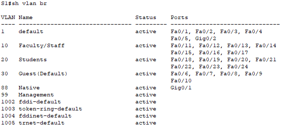

### Trunk Verification

The `show interfaces trunk` command confirms that `G0/1` is working as a trunk and that VLAN 88 is used as the native VLAN.

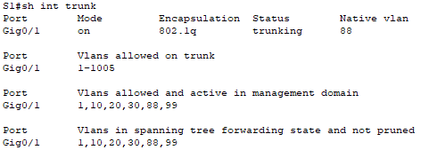

### S1 Interface Status

The `show ip interface brief` command confirms that VLAN 99 has the correct management IP address and that the trunk port is up.

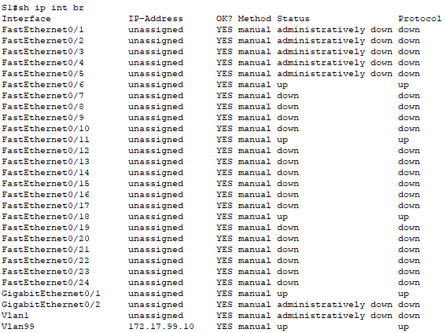

### R1 Subinterface Verification

The `show ip interface brief` command on R1 confirms that all router subinterfaces are up/up.

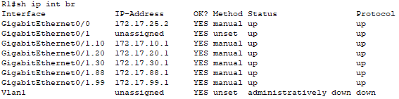

### Routing Table Verification

The `show ip route` command shows connected routes for VLAN 10, VLAN 20, VLAN 30, VLAN 88, and VLAN 99.

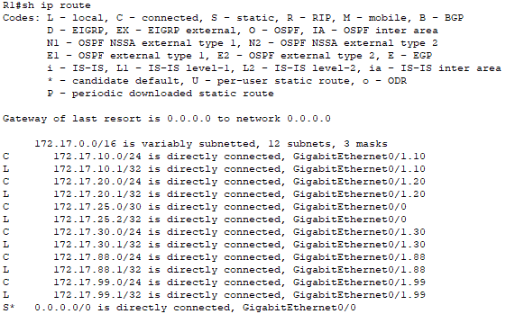

### Inter-VLAN Connectivity Tests

PC1 successfully pinged PC2 in another VLAN:

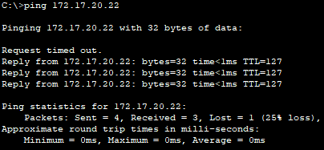

PC1 successfully pinged PC3 in another VLAN:

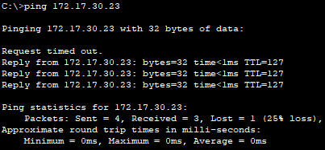

PC1 successfully pinged the server:

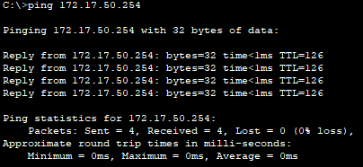

PC2 successfully pinged the server:

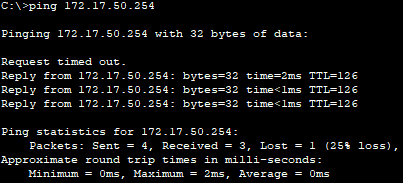

PC3 successfully pinged the server:

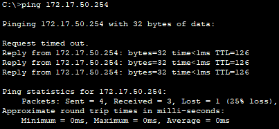

## 🛠️Troubleshooting Notes

### Trunk did not appear before the router interface was enabled

At one point, `show interfaces trunk` did not display the trunk. The switch port was configured as a trunk, but the physical link was still down because the router interface was not enabled yet.

The issue was resolved after enabling the physical router interface:

```text
R1(config)# interface g0/1
R1(config-if)# no shutdown
```

After that, the router subinterfaces came up and the trunk link became active.

### VLAN 99 SVI depends on Layer 2 availability

The management SVI on S1 uses VLAN 99. The SVI may not become fully operational until VLAN 99 is active on the switch and carried over an active trunk link.

### Inter-VLAN routing requires correct default gateways

Each PC must use the router subinterface IP address as its default gateway:

* PC1 uses `172.17.10.1`
* PC2 uses `172.17.20.1`
* PC3 uses `172.17.30.1`

Without the correct default gateway, the PCs can communicate only inside their local VLAN.

## 🧠Lessons Learned

This lab helped reinforce the practical process of router-on-a-stick inter-VLAN routing:

* VLANs separate a switched network into different broadcast domains.
* Devices in different VLANs require Layer 3 routing to communicate.
* Router-on-a-stick uses one physical router interface with multiple logical subinterfaces.
* Each router subinterface is mapped to a VLAN using `encapsulation dot1Q`.
* The router subinterface IP address acts as the default gateway for that VLAN.
* The switch port connected to the router must be configured as a trunk.
* `show vlan brief`, `show interfaces trunk` and `show ip route` are essential verification commands for inter-VLAN routing.

## 📁Files

| File | Description |
|---|---|
| [topology.png](./topology.png) | Network topology |
| [inter-vlan-routing-challenge.pka](./packet-tracer/inter-vlan-routing-challenge.pka) | Completed Packet Tracer lab file |
| [r1-config.txt](./configs/r1-config.txt) | Final R1 configuration |
| [s1-config.txt](./configs/s1-config.txt) | Final S1 configuration |
| [screenshots/](./screenshots/) | Verification screenshots |