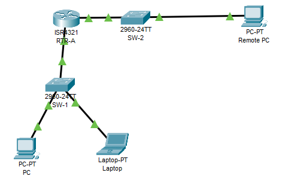
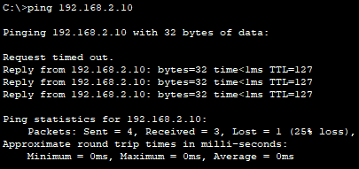
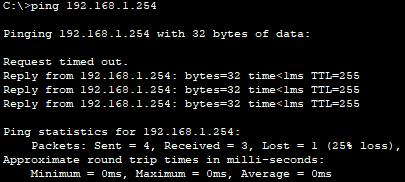
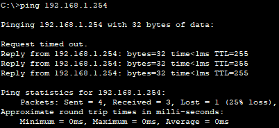
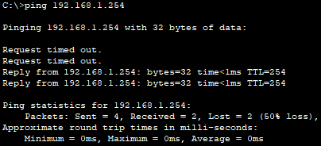

# Secure Network Devices

## 📌Overview

This lab demonstrates basic security hardening on Cisco network devices in Packet Tracer.

The topology includes one router, two switches, two local end devices, and one remote PC. The router and switch were configured with secure management settings, SSH access, encrypted passwords, local user authentication, session timeout, login protection, and disabled unused switch ports.

The goal of this lab was to secure basic device access while maintaining connectivity between both LANs and the switch management interface.


## 🎯Objectives

* Configure IPv4 addressing according to the addressing table
* Configure secure privileged EXEC access
* Configure console access security
* Encrypt plaintext passwords
* Configure a local administrative user
* Enable SSH remote access
* Restrict VTY access to SSH only
* Configure session timeout for console and VTY lines
* Configure login blocking against brute-force attempts
* Configure the switch management SVI
* Verify connectivity between LANs
* Verify access to the switch management interface

## Topology



## 📋Addressing Table

| Device    | Interface | IP Address      | Subnet Mask     | Default Gateway |
| --------- | --------- | --------------- | --------------- | --------------- |
| RTR-A     | G0/0/0    | `192.168.1.1`   | `255.255.255.0` | N/A             |
| RTR-A     | G0/0/1    | `192.168.2.1`   | `255.255.255.0` | N/A             |
| SW-1      | VLAN 1    | `192.168.1.254` | `255.255.255.0` | `192.168.1.1`   |
| PC        | NIC       | `192.168.1.2`   | `255.255.255.0` | `192.168.1.1`   |
| Laptop    | NIC       | `192.168.1.10`  | `255.255.255.0` | `192.168.1.1`   |
| Remote PC | NIC       | `192.168.2.10`  | `255.255.255.0` | `192.168.2.1`   |

## ⚙️Configuration Summary

### Router RTR-A

The router was configured with:

* hostname `RTR-A`
* DNS lookup disabled
* minimum password length set to 10 characters
* console password
* console and VTY session timeout
* encrypted privileged EXEC password
* MOTD banner
* password encryption
* local user `NETadmin`
* domain name `security.com`
* RSA keys for SSH
* VTY lines restricted to SSH only
* local authentication on VTY lines
* login blocking for failed login attempts
* IPv4 addressing on `G0/0/0` and `G0/0/1`

Router interface configuration:

```text
RTR-A G0/0/0: 192.168.1.1/24
RTR-A G0/0/1: 192.168.2.1/24
```

Main security configuration:

```text
no ip domain-lookup
security passwords min-length 10
enable secret @Cons1234!
service password-encryption
username NETadmin secret LogAdmin!9
ip domain-name security.com
login block-for 45 attempts 3 within 100
```

VTY configuration:

```text
line vty 0 15
 login local
 transport input ssh
 exec-timeout 7 0
```


### Switch SW-1

The switch was configured with:

* hostname `SW-1`
* management IP address on VLAN 1
* default gateway pointing to RTR-A
* privileged EXEC password
* domain name `security.com`
* local user `NETadmin`
* RSA keys for SSH
* VTY lines restricted to SSH only
* local authentication on VTY lines
* unused switch ports administratively shut down

Switch management configuration:

```text
SW-1 VLAN 1: 192.168.1.254/24
Default gateway: 192.168.1.1
```

Unused switch ports were disabled:

```text
interface range FastEthernet0/1, FastEthernet0/3-9, FastEthernet0/11-24, GigabitEthernet0/2
 shutdown
```

### End Devices

The end devices were configured with static IPv4 addressing:

```text
PC:        192.168.1.2/24, gateway 192.168.1.1
Laptop:    192.168.1.10/24, gateway 192.168.1.1
Remote PC: 192.168.2.10/24, gateway 192.168.2.1
```

## ✅Verification

### PC to Remote PC Connectivity

Connectivity between the local LAN and the remote LAN was verified with ping.



The first ICMP request timed out, which is normal when ARP resolution is required. The following replies were successful, confirming that routing between the two LANs was working.

### SW-1 Management Interface Connectivity

Connectivity to the SW-1 management interface was verified from all end devices.





PC and laptop successfully reached the SW-1 management IP address `192.168.1.254`.

#### Remote PC to SW-1



The Remote PC successfully reached the SW-1 management IP address `192.168.1.254` through RTR-A.

## 🛠️Troubleshooting Notes

### Local user command syntax

The local user must be created with an encrypted secret password.

Incorrect example:

```cisco
username NETadmin password LogAdmin!9
```

Correct command:

```cisco
username NETadmin secret LogAdmin!9
```

## 🧠Lessons Learned

This lab helped reinforce basic network device hardening concepts:

* Network devices should use unique hostnames.
* Strong passwords and password length requirements improve access security.
* `enable secret` should be used instead of weaker password methods.
* Plaintext passwords should be encrypted in the configuration.
* SSH should be used instead of Telnet for remote management.
* SSH requires a hostname, domain name, local user, and RSA keys.
* VTY lines should use local authentication and allow SSH only.
* Login blocking helps reduce brute-force login attempts.
* Session timeout helps close inactive management sessions.
* Unused switch ports should be administratively shut down.

## 📁Files

| File                                                                     | Description                                |
| ------------------------------------------------------------------------ | ------------------------------------------ |
| [topology.png](./topology.png)                                           | Network topology                           |
| [secure-network-devices.pka](./packet-tracer/secure-network-devices.pka) | Completed Packet Tracer network file       |
| [rtr-a-config.txt](./configs/rtr-a-config.txt)                           | Final RTR-A configuration                  |
| [sw-1-config.txt](./configs/sw-1-config.txt)                             | Final SW-1 configuration                   |
| [screenshots/](./screenshots/)                                           | Verification and configuration screenshots |