# Switch Security Configuration

## 📌Overview

This lab strengthens Layer 2 security on two access switches in a partially configured network. Static trunks use VLAN 100 as the native VLAN with DTP disabled. Unused SW-1 ports are isolated in VLAN 999 and administratively disabled. Port Security, DHCP Snooping, PortFast, and BPDU Guard protect the active access layer while preserving inter-VLAN connectivity.

## 🎯Objectives

- Configure secure static trunks and disable DTP negotiation.
- Configure VLAN 100 as the native VLAN on all trunk links.
- Move unused SW-1 ports to the BlackHole VLAN and shut them down.
- Apply Port Security to all active SW-1 access ports.
- Configure static and sticky secure MAC address learning.
- Configure DHCP Snooping trust and rate limiting.
- Enable PortFast and BPDU Guard on active access ports.
- Verify Layer 2 security settings and inter-VLAN connectivity.

## Topology

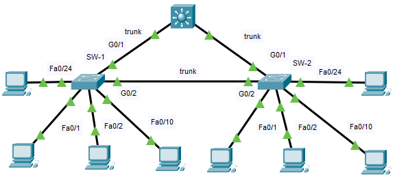

## 📋Addressing Table

| Switch | VLAN | VLAN Name | Port Membership | Network |
| ------ | ---- | --------- | --------------- | ------- |
| SW-1 | `10` | Admin | F0/1, F0/2 | `192.168.10.0/24` |
| SW-1 | `20` | Sales | F0/10 | `192.168.20.0/24` |
| SW-1 | `99` | Management | F0/24 | `192.168.99.0/24` |
| SW-1 | `100` | Native | G0/1, G0/2 | None |
| SW-1 | `999` | BlackHole | All unused ports | None |
| SW-2 | `10` | Admin | F0/1, F0/22 | `192.168.10.0/24` |
| SW-2 | `20` | Sales | F0/10 | `192.168.20.0/24` |
| SW-2 | `99` | Management | F0/24 | `192.168.99.0/24` |
| SW-2 | `100` | Native | Native VLAN on G0/1 and G0/2 | None |
| SW-2 | `999` | BlackHole | All unused ports | None |

## ⚙️Configuration Summary

### SW-1

- Configured G0/1 and G0/2 as static trunks.
- Disabled DTP negotiation and assigned VLAN 100 as the native VLAN.
- Created VLAN 999 named `BlackHole`.
- Assigned F0/3-F0/9 and F0/11-F0/23 to VLAN 999 and shut them down.
- Enabled Port Security on F0/1, F0/2, F0/10, and F0/24.
- Limited each active access port to four secure MAC addresses.
- Added the PC MAC address `0010.11E8.3CBB` statically on F0/1.
- Enabled sticky MAC learning and `restrict` violation mode.
- Trusted the trunk ports for DHCP Snooping and limited active untrusted ports to five DHCP packets per second.
- Enabled PortFast and BPDU Guard on all active access ports.

### SW-2

- Configured G0/1 and G0/2 as static trunks.
- Disabled DTP negotiation and assigned VLAN 100 as the native VLAN.
- Enabled DHCP Snooping globally for VLANs 10, 20, and 99.
- Enabled PortFast and BPDU Guard globally on access ports.

## ✅Verification

### Secure Trunks

Both switches formed static trunk links on G0/1 and G0/2, with VLAN 100 operating as the native VLAN.

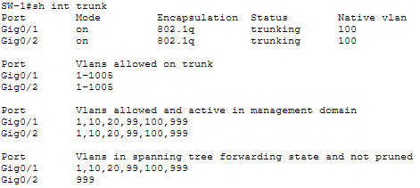

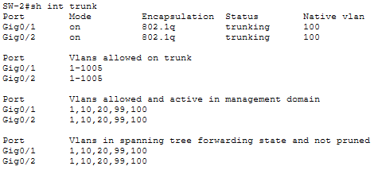

### Unused Port Isolation

All unused FastEthernet ports on SW-1 were assigned to VLAN 999 and remained administratively disabled.

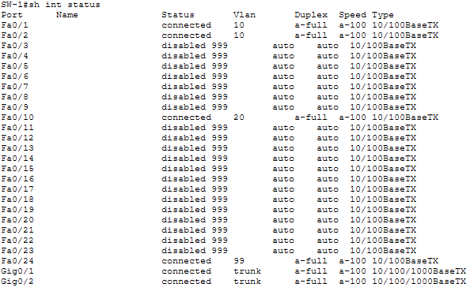

### Port Security

Port Security was active on all four in-use access ports. Each port allowed a maximum of four secure MAC addresses and used the `restrict` violation mode.

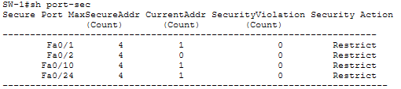

F0/1 contained the statically configured PC MAC address and supported sticky MAC learning.

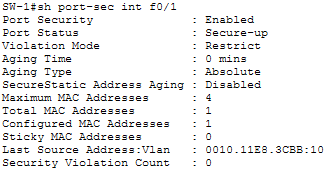

### DHCP Snooping

SW-1 treated G0/1 and G0/2 as trusted interfaces and enforced a rate limit of five DHCP packets per second on active untrusted access ports.

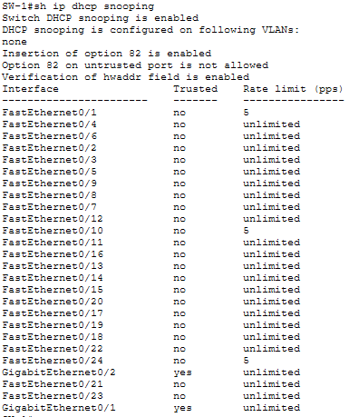

SW-2 had DHCP Snooping enabled globally for VLANs 10, 20, and 99.

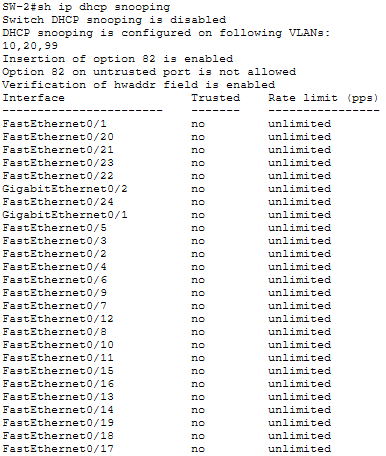

### PortFast and BPDU Guard

PortFast and BPDU Guard were active on the in-use SW-1 access ports, while SW-2 applied both protections to PortFast-enabled access ports by default.

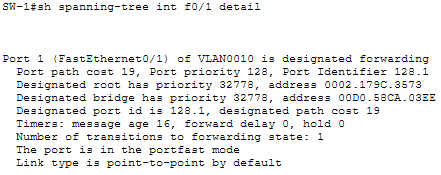

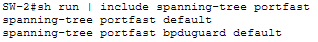

### Inter-VLAN Connectivity

The successful ping between hosts in different VLANs confirmed that the security configuration preserved end-to-end connectivity through the preconfigured routing layer.

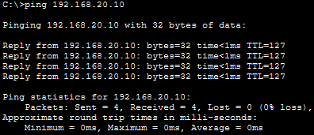

## 🛠️Troubleshooting Notes

### Port Security enabled on trunk interfaces

Port Security was accidentally applied to G0/1 and G0/2 together with the active access ports. Because the trunk links carried MAC addresses from multiple devices, both interfaces detected security violations and entered the err-disabled state.

Port Security was removed from the trunk interfaces, and the links were reset with a shutdown and no shutdown sequence. Both ports then returned to the up state and continued operating as static trunks.

### Native VLAN mismatch during trunk configuration

CDP native VLAN mismatch and STP PVID inconsistency messages appeared while VLAN 100 had been applied on only one side of a trunk. STP temporarily blocked the inconsistent link to protect the topology.

After VLAN 100 was created and configured as the native VLAN on both ends of every trunk, the port consistency checks passed and the links returned to the forwarding state.

## 🧠Lessons Learned

- Static trunking and disabled DTP reduce the risk of unauthorized trunk negotiation.
- A dedicated unused VLAN combined with administratively disabled ports prevents inactive interfaces from providing network access.
- Port Security can combine a manually configured MAC address with sticky learning on the same access port.
- The `restrict` violation mode drops unauthorized frames and records violations without disabling the interface.
- DHCP Snooping separates trusted infrastructure links from untrusted client ports.
- PortFast improves host connectivity time, while BPDU Guard protects ports from unexpected switches and Layer 2 loops.

## 📁Files

| File | Description |
| ---- | ----------- |
| [topology.png](./topology.png) | Completed Packet Tracer topology |
| [switch-security-configuration.pka](./packet-tracer/switch-security-configuration.pka) | Completed Packet Tracer lab file |
| [sw1-config.txt](./configs/sw1-config.txt) | Final SW-1 configuration |
| [sw2-config.txt](./configs/sw2-config.txt) | Final SW-2 configuration |
| [screenshots/](./screenshots/) | Verification screenshots |
