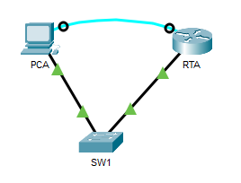
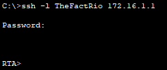
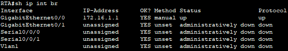
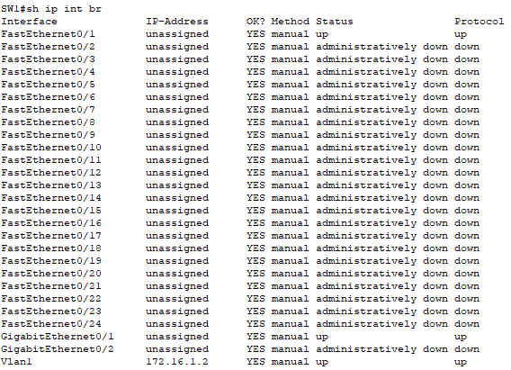

# Secure Passwords and SSH

## 📌Overview

This lab demonstrates basic security hardening on a Cisco router and Layer 2 switch in Cisco Packet Tracer.

The network was configured with static IPv4 addressing, switch management access, SSH remote access, local user authentication, encrypted passwords, login protection, session timeout, and disabled unused switch ports.

## 🎯Objectives

* Configure IPv4 addressing on the router, switch, and PC
* Configure basic security settings on the router
* Configure basic security settings on the switch
* Enable SSH remote access
* Create local user accounts for authentication
* Encrypt plaintext passwords
* Set a minimum password length on the router
* Configure login blocking against brute-force attempts
* Configure EXEC session timeout
* Disable DNS lookup
* Disable unused switch ports
* Save the final configuration to NVRAM
* Verify SSH access from PCA to RTA

## Topology



## 📋Addressing Table

| Device | Interface | IP Address    | Subnet Mask     | Default Gateway |
| ------ | --------- | ------------- | --------------- | --------------- |
| RTA    | G0/0      | `172.16.1.1`  | `255.255.255.0` | N/A             |
| PCA    | NIC       | `172.16.1.10` | `255.255.255.0` | `172.16.1.1`    |
| SW1    | VLAN 1    | `172.16.1.2`  | `255.255.255.0` | `172.16.1.1`    |

## ⚙️Configuration Summary

### Router RTA

The router was configured with:

* hostname `RTA`
* IPv4 address `172.16.1.1/24` on interface `G0/0`
* interface `G0/0` enabled with `no shutdown`
* plaintext password encryption
* minimum password length set to `10`
* encrypted privileged EXEC password
* DNS lookup disabled
* domain name `CCNA.com`
* local SSH user `TheFactRio`
* 1024-bit RSA keys
* login blocking after failed login attempts
* VTY lines configured for SSH only
* local authentication on VTY lines
* EXEC session timeout set to 6 minutes
* startup configuration saved to NVRAM

Router interface configuration:

```text
RTA G0/0: 172.16.1.1/24
```

Main security configuration:

```text
service password-encryption
security passwords min-length 10
enable secret gow1thc0ffe
no ip domain-lookup
ip domain-name CCNA.com
username TheFactRio secret m0rn1ng1sgood
crypto key generate rsa general-keys modulus 1024
login block-for 180 attempts 4 within 120
```

VTY configuration:

```text
line vty 0 4
 transport input ssh
 login local
 exec-timeout 6
```


### Switch SW1

The switch was configured with:

* hostname `SW1`
* management IP address `172.16.1.2/24` on VLAN 1
* VLAN 1 interface enabled with `no shutdown`
* default gateway `172.16.1.1`
* unused switch ports disabled
* plaintext password encryption
* encrypted privileged EXEC password
* DNS lookup disabled
* domain name `CCNA.com`
* local SSH user `Rossito`
* 1024-bit RSA keys
* all VTY lines configured for SSH only
* local authentication on VTY lines
* EXEC session timeout set to 6 minutes
* startup configuration saved to NVRAM

Switch management configuration:

```text
SW1 VLAN 1: 172.16.1.2/24
Default gateway: 172.16.1.1
```

Main security configuration:

```text
service password-encryption
enable secret d4ybyd4y
no ip domain-lookup
ip domain-name CCNA.com
username Rossito secret l41talian0
crypto key generate rsa
```

VTY configuration:

```text
line vty 0 15
 login local
 transport input ssh
 exec-timeout 6
```

Unused switch ports were disabled:

```text
interface range F0/2-24, G0/2
 shutdown
```

This prevents unauthorized devices from being connected to unused switch ports.

### Host PC-A


## ✅Verification

### SSH Access to RTA

SSH access from PCA to RTA was tested with the following command:



The successful SSH login confirmed that:

* RTA had RSA keys generated
* SSH was enabled
* VTY lines accepted SSH only
* local user authentication was working
* PCA could reach the router management IP address

### Router Interface Status

The router interface `G0/0` was enabled and moved to the up/up state after the IP address was configured and `no shutdown` was applied.



### Switch Interface Status

The switch management interface was configured on VLAN 1. Unused switch ports were administratively shut down.



## 🛠️Troubleshooting Notes

No major issues were encountered during this lab.

The following items were checked during verification:

* Interface status was verified.
* IP addressing was checked against the addressing table.
* SSH access was tested from the client.
* VTY lines were confirmed to allow SSH access only.
* The final configuration was saved to startup configuration.

## 🧠Lessons Learned

This lab helped reinforce basic network device hardening concepts:

* Plaintext passwords should be encrypted in the configuration.
* Strong privileged EXEC passwords should be configured with `enable secret`.
* SSH should be used instead of Telnet for remote access.
* RSA keys and a domain name are required for SSH.
* Local user accounts can be used for SSH authentication.
* Login blocking helps reduce brute-force login attempts.
* EXEC timeout automatically closes inactive management sessions.
* Unused switch ports should be shut down.

## 📁Files

| File | Description |
|---|---|
| [topology.png](./topology.png) | Network topology |
| [Configure Secure Passwords and SSH.pka](./packet-tracer/сonfigure-secure-passwords-and-ssh.pka) | Completed Packet Tracer lab file |
| [RTA-config.txt](./configs/rta-config.txt) | Final RTA configuration |
| [SW1-config.txt](./configs/sw1-config.txt) | Final SW1 configuration |
| [screenshots/](./screenshots/) | Verification and configuration screenshots |