# Troubleshoot Connectivity Issues

## 📌Overview

This lab focuses on troubleshooting connectivity issues in a small company LAN.

The users were experiencing slow response times and could not reach the external server `209.165.200.226`. The troubleshooting process included checking host addressing, switch management settings, interface status, speed and duplex settings, and the router routing table.

After identifying the issues, configuration changes were applied on PC-A, S1, and R1 to restore full connectivity.

## 🎯Objectives

* Identify network connectivity issues
* Use basic troubleshooting commands on hosts and Cisco IOS devices
* Verify interface status and configuration
* Identify incorrect speed and duplex settings
* Correct switch management configuration
* Correct PC-A default gateway configuration
* Add a missing default route on R1
* Verify connectivity to the external server
* Document troubleshooting findings and configuration changes

## Topology

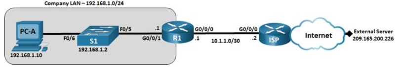

## 📋Addressing Table

| Device | Interface | IP Address | Subnet Mask | Default Gateway |
|---|---|---|---|---|
| R1 | G0/0/0 | `10.1.1.1` | `255.255.255.252` | N/A |
| R1 | G0/0/1 | `192.168.1.1` | `255.255.255.0` | N/A |
| ISP | G0/0/0 | `10.1.1.2` | `255.255.255.252` | N/A |
| ISP | Loopback | `209.165.200.226` | `255.255.255.255` | N/A |
| S1 | VLAN 1 | `192.168.1.2` | `255.255.255.0` | `192.168.1.1` |
| PC-A | NIC | `192.168.1.10` | `255.255.255.0` | `192.168.1.1` |

## ⚙️Configuration Summary

### PC-A

PC-A had an IPv4 address in the correct local network, but the default gateway was missing.

Initial PC-A IP configuration:

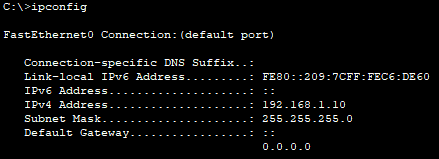

The default gateway was corrected to:

```text
192.168.1.1
````

This allowed PC-A to send traffic to remote networks through R1.

### S1

The switch management interface and uplink interface required correction.

Issues found on S1:

* VLAN 1 was administratively down
* S1 had an incorrect default gateway
* FastEthernet0/5 was configured as half-duplex
* FastEthernet0/5 was configured for 10 Mbps

S1 interface status before fixes:

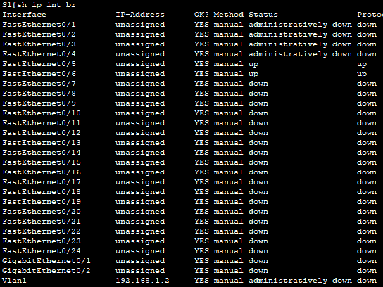

S1 FastEthernet0/5 before fixes:

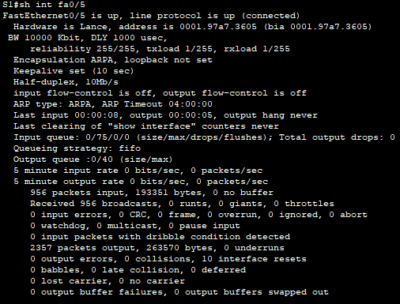

S1 FastEthernet0/5 running configuration before fixes:

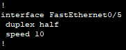

S1 VLAN 1 and default gateway configuration before fixes:

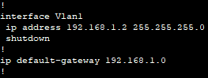

The following changes were applied on S1:

```cisco
interface vlan 1
 no shutdown
!
ip default-gateway 192.168.1.1
!
interface FastEthernet0/5
 duplex full
 speed 100
```

### R1

R1 had connectivity to the ISP network, but the LAN-facing interface and routing table required correction.

R1 interface status before fixes:

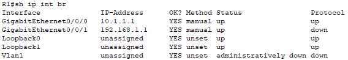

R1 G0/0/0 status:

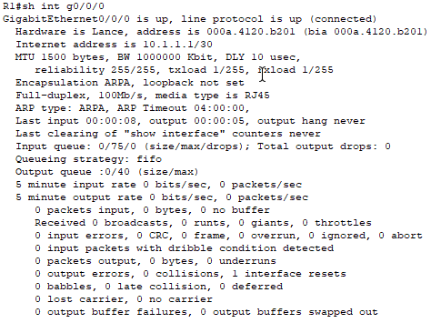

R1 G0/0/1 status before fixes:

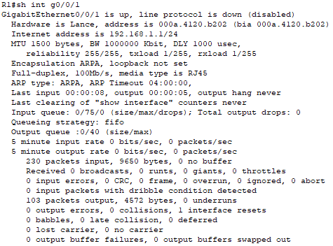

R1 running configuration before fixes:

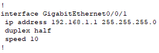

Issues found on R1:

* G0/0/1 had incorrect speed and duplex settings
* R1 did not have a default route to the ISP
* The routing table did not contain a gateway of last resort

The following changes were applied on R1:

```cisco
interface GigabitEthernet0/0/1
 duplex full
 speed 100
!
ip route 0.0.0.0 0.0.0.0 10.1.1.2
```

The default static route sends unknown destination traffic to the ISP router at `10.1.1.2`.

## ✅Verification

### Initial Ping Tests

Before the fixes, PC-A could reach the local R1 interface, but it could not reach S1 management or the external server.

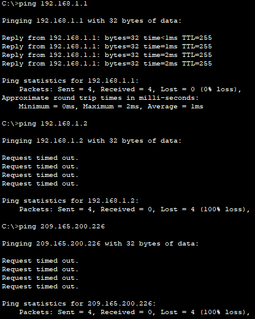

Initial result:

```text
PC-A -> 192.168.1.1        Success
PC-A -> 192.168.1.2        Failed
PC-A -> 209.165.200.226    Failed
```

### Final Ping Tests

After correcting PC-A, S1, and R1, PC-A successfully reached the local gateway, the switch management interface, and the external server.

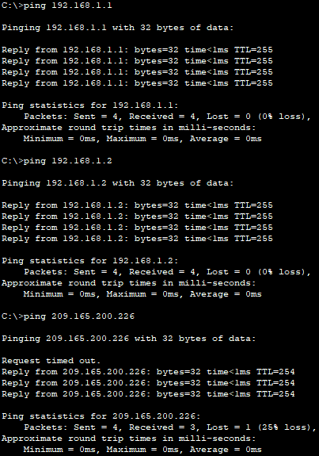

Final result:

```text
PC-A -> 192.168.1.1        Success
PC-A -> 192.168.1.2        Success
PC-A -> 209.165.200.226    Success
```

The first request timeout during the final ping to `209.165.200.226` is expected because ARP resolution may occur before the first successful reply.

## 🛠️Troubleshooting Notes

### Issue 1: PC-A Missing Default Gateway

PC-A had the correct IP address and subnet mask, but the default gateway was missing.

Because of this, PC-A could communicate with devices in the local `192.168.1.0/24` network but could not properly reach remote networks.

Fix:

```text
Default Gateway: 192.168.1.1
```

### Issue 2: S1 VLAN 1 Was Shut Down

The S1 management interface had the correct IP address, but VLAN 1 was administratively down.

Fix:

```cisco
interface vlan 1
 no shutdown
```

### Issue 3: Incorrect S1 Default Gateway

S1 was configured with an incorrect default gateway:

```cisco
ip default-gateway 192.168.1.0
```

This address represents the network address, not a usable host address.

Fix:

```cisco
ip default-gateway 192.168.1.1
```

### Issue 4: Incorrect Speed and Duplex on S1 Fa0/5

S1 FastEthernet0/5 was configured as:

```cisco
duplex half
speed 10
```

This could cause slow response times.

Fix:

```cisco
interface FastEthernet0/5
 duplex full
 speed 100
```

### Issue 5: Incorrect Speed and Duplex on R1 G0/0/1

R1 G0/0/1 had incorrect speed and duplex settings on the LAN-facing interface.

Fix:

```cisco
interface GigabitEthernet0/0/1
 duplex full
 speed 100
```

### Issue 6: Missing Default Route on R1

R1 did not have a gateway of last resort. Because of this, R1 did not know where to forward traffic destined for external networks such as `209.165.200.226`.

Fix:

```cisco
ip route 0.0.0.0 0.0.0.0 10.1.1.2
```

This route tells R1 to forward unknown destination traffic to the ISP router.

## 🧠Lessons Learned

This lab helped reinforce basic network device hardening concepts:

* Troubleshooting should follow the traffic path step by step.
* Successful local connectivity does not always mean external connectivity is working.
* A missing default gateway on a host prevents communication with remote networks.
* A switch needs a correct default gateway for management traffic outside the local network.
* Incorrect speed and duplex settings can cause slow network performance.
* `show ip interface brief` is useful for quickly checking interface status.
* `show interfaces` helps identify speed, duplex, and interface-level issues.
* `show ip route` is essential when local connectivity works but remote connectivity fails.
* A default static route is required when a router must forward traffic to unknown external networks.

## 📁Files

## Files

| File | Description |
|---|---|
| [topology.png](./topology.png) | Network topology |
| [troubleshoot-connectivity-issues.pka](./packet-tracer/troubleshoot-connectivity-issues.pka) | Completed Packet Tracer activity |
| [r1-config.txt](./configs/r1-config.txt) | Final R1 configuration after troubleshooting |
| [s1-config.txt](./configs/s1-config.txt) | Final S1 configuration after troubleshooting |
| [screenshots/](./screenshots/) | Before and after troubleshooting verification screenshots |
