# Troubleshooting Challenge

## 📌Overview

This lab focuses on troubleshooting common LAN configuration issues in a multi-subnet network.

After a network update, several devices were misconfigured. The task was to identify and fix the issues so that all PCs could reach the Web server, R1, and the switches. IPv4 and IPv6 connectivity were verified where required, and SSH access to R1 was restored.

## 🎯Objectives

* Troubleshoot common LAN connectivity issues
* Verify IPv4 addressing and default gateway settings
* Verify IPv6 addressing and connectivity
* Identify incorrect subnet mask configuration
* Identify incorrect router interface addressing
* Restore SSH access to R1
* Verify connectivity from all PCs to the Web server
* Document findings and configuration changes

## Topology

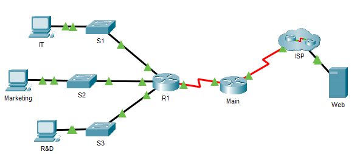

## 📋Addressing Table

| Device | Interface | IPv4 Address / Prefix | IPv6 Address / Prefix | Default Gateway |
|---|---|---|---|---|
| R1 | G0/0 | `172.16.1.62/26` | `2001:db8:cafe::1/64`, `fe80::1` | N/A |
| R1 | G0/1 | `172.16.1.126/26` | `2001:db8:cafe:1::1/64`, `fe80::1` | N/A |
| R1 | G0/2 | `172.16.1.254/25` | `2001:db8:cafe:2::1/64`, `fe80::1` | N/A |
| R1 | S0/0/1 | `10.0.0.2/30` | `2001:db8:2::1/64`, `fe80::1` | N/A |
| Main | S0/0/0 | `209.165.200.226/30` | `2001:db8:1::1/64`, `fe80::2` | N/A |
| Main | S0/0/1 | `10.0.0.1/30` | `2001:db8:2::2/64`, `fe80::2` | N/A |
| S1 | VLAN 1 | `172.16.1.61/26` | N/A | `172.16.1.62` |
| S2 | VLAN 1 | `172.16.1.125/26` | N/A | `172.16.1.126` |
| S3 | VLAN 1 | `172.16.1.253/25` | N/A | `172.16.1.254` |
| IT | NIC | `172.16.1.1/26` | `2001:db8:cafe::2/64`, `fe80::2` | `172.16.1.62`, `fe80::1` |
| Marketing | NIC | `172.16.1.65/26` | `2001:db8:cafe:1::2/64`, `fe80::2` | `172.16.1.126`, `fe80::1` |
| R&D | NIC | `172.16.1.129/25` | `2001:db8:cafe:2::2/64`, `fe80::2` | `172.16.1.254`, `fe80::1` |
| Web | NIC | `64.100.0.3/29` | `2001:db8:acad::3/64`, `fe80::2` | `64.100.0.1`, `fe80::1` |

## ⚙️Configuration Summary

### R1

R1 was configured with three LAN-facing interfaces and one serial connection toward the Main router.

Final R1 interface addressing:

```text
G0/0     172.16.1.62/26
G0/1     172.16.1.126/26
G0/2     172.16.1.254/25
S0/0/1   10.0.0.2/30
````

R1 also includes IPv6 addressing, IPv4 and IPv6 default routes, and SSH access using the local user `Admin1`.

The VTY lines were updated to allow SSH instead of Telnet.

```cisco
line vty 0 15
 login local
 transport input ssh
```

### S1

S1 was configured as the management switch for the IT subnet.

```text
S1 VLAN 1: 172.16.1.61/26
Default gateway: 172.16.1.62
```

### S2

S2 was configured as the management switch for the Marketing subnet.

The VLAN 1 subnet mask was corrected from `/27` to `/26`.

```text
S2 VLAN 1: 172.16.1.125/26
Default gateway: 172.16.1.126
```

### S3

S3 was configured as the management switch for the R&D subnet.

```text
S3 VLAN 1: 172.16.1.253/25
Default gateway: 172.16.1.254
```

### End Devices

The end devices were configured according to their assigned subnets:

```text
IT:         172.16.1.1/26, gateway 172.16.1.62
Marketing:  172.16.1.65/26, gateway 172.16.1.126
R&D:        172.16.1.129/25, gateway 172.16.1.254
```

## ✅Verification

### IT PC Verification

Initial IT PC addressing was checked with `ipconfig`.

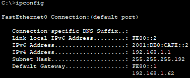

Before troubleshooting, IT PC connectivity tests failed.

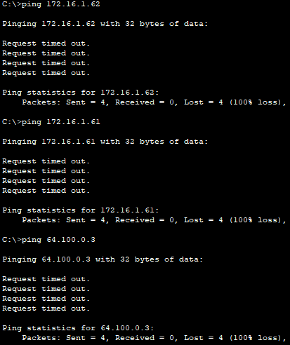

After the configuration changes, IT PC successfully reached R1, S1, and the Web server.

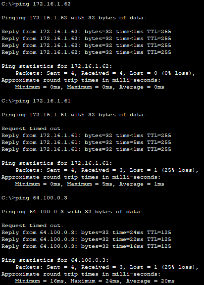

Final IT PC IP configuration:

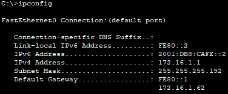

### Marketing PC Verification

Before troubleshooting, Marketing PC could not reach the required network devices or the Web server.

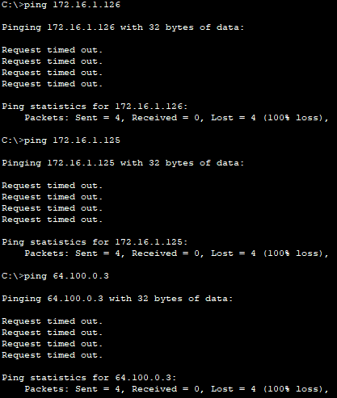

After troubleshooting, Marketing PC successfully reached its gateway, switch management interface, and the Web server.

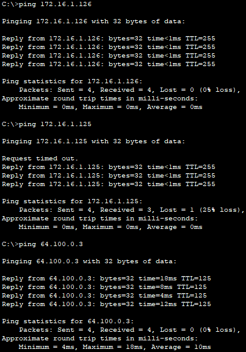

### R&D PC Verification

Initial R&D PC addressing was checked with `ipconfig`.

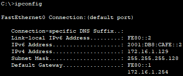

Before troubleshooting, R&D PC connectivity tests failed.

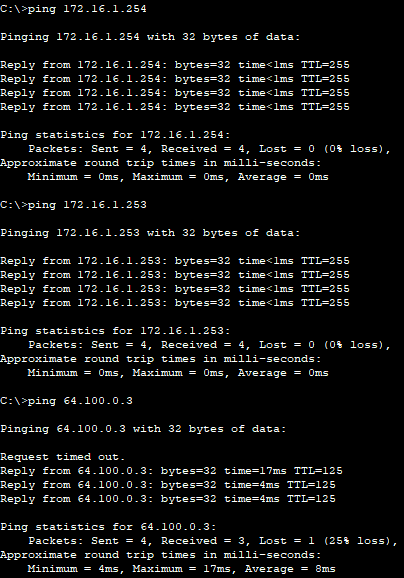

After correcting the configuration, R&D PC successfully reached R1, S3, and the Web server.

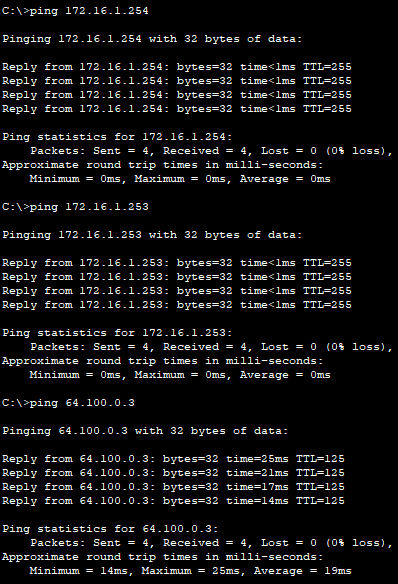

Final R&D PC IP configuration:

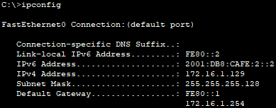

### IPv6 Verification

IPv6 connectivity was verified from each PC to its local R1 gateway and to the Web server.

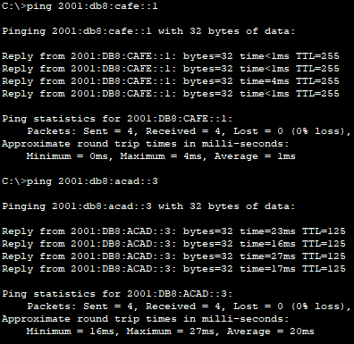

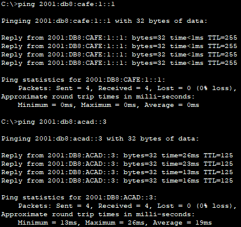

Before troubleshooting, R&D IPv6 connectivity was not working correctly.

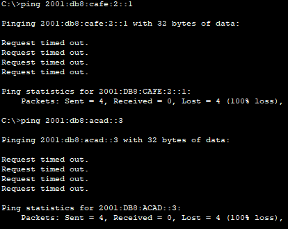

After the configuration changes, R&D IPv6 connectivity was verified.

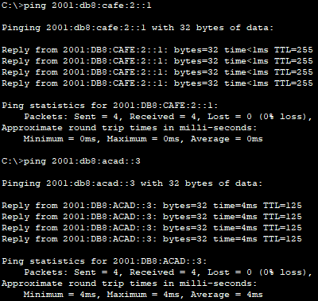

### R1 Verification

R1 interface status was verified with `show ip interface brief`.

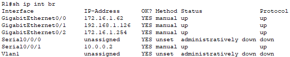

R1 IPv6 interface status was checked with `show ipv6 interface brief`.


The R1 configuration was reviewed to identify the VTY access issue.

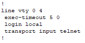

### S2 Verification

S2 running configuration was checked because the Marketing subnet had connectivity issues.

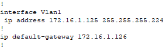

## 🛠️Troubleshooting Notes

### Issue 1: IT PC Default Gateway

The IT PC configuration was checked first. The PC had to use the R1 interface in the IT subnet as its default gateway.

Correct gateway:

```text
172.16.1.62
```

After correcting the gateway, IT PC was able to reach remote networks.

### Issue 2: S2 Incorrect Subnet Mask

S2 VLAN 1 was configured with the wrong subnet mask.

Incorrect configuration:

```cisco
interface Vlan1
 ip address 172.16.1.125 255.255.255.224
```

Correct configuration:

```cisco
interface Vlan1
 ip address 172.16.1.125 255.255.255.192
```

### Issue 3: R1 G0/1 Incorrect IPv4 Address

R1 G0/1 was configured with the wrong IPv4 network.

Incorrect configuration:

```cisco
interface GigabitEthernet0/1
 ip address 192.168.1.126 255.255.255.192
```

Correct configuration:

```cisco
interface GigabitEthernet0/1
 ip address 172.16.1.126 255.255.255.192
```

This restored connectivity for the Marketing subnet.

### Issue 4: SSH Access to R1

SSH was enabled on R1, but the VTY lines were configured to accept Telnet.

Incorrect VTY configuration:

```cisco
line vty 0 4
 login local
 transport input telnet
```

Correct VTY configuration:

```cisco
line vty 0 15
 login local
 transport input ssh
```

A local SSH user was configured:

```cisco
username Admin1 secret Admin1pa55
```

RSA keys were regenerated with a modulus of 1024 bits.

## 🧠Lessons Learned

This lab helped reinforce basic network device hardening concepts:

* Troubleshooting should start from the end device and move step by step toward the destination.
* A wrong default gateway on a PC can prevent access to remote networks.
* A wrong subnet mask can place a device in the wrong logical subnet.
* `show ip interface brief` is useful for quickly checking interface addressing and status.
* `show running-config` helps identify incorrect interface and VTY settings.
* SSH access requires correct VTY configuration, local authentication, and RSA keys.
* `transport input ssh` is required to allow SSH access on VTY lines.
* IPv4 and IPv6 should be verified separately during troubleshooting.

## 📁Files

## Files

| File                                                                           | Description                                  |
| ------------------------------------------------------------------------------ | -------------------------------------------- |
| [topology.png](./topology.png)                                                 | Network topology                             |
| [troubleshooting-challenge.pka](./packet-tracer/troubleshooting-challenge.pka) | Completed Packet Tracer activity             |
| [r1-config.txt](./configs/r1-config.txt)                                       | Final R1 configuration                       |
| [s1-config.txt](./configs/s1-config.txt)                                       | Final S1 configuration                       |
| [s2-config.txt](./configs/s2-config.txt)                                       | Final S2 configuration                       |
| [s3-config.txt](./configs/s3-config.txt)                                       | Final S3 configuration                       |
| [screenshots/](./screenshots/)                                                 | Troubleshooting and verification screenshots |
